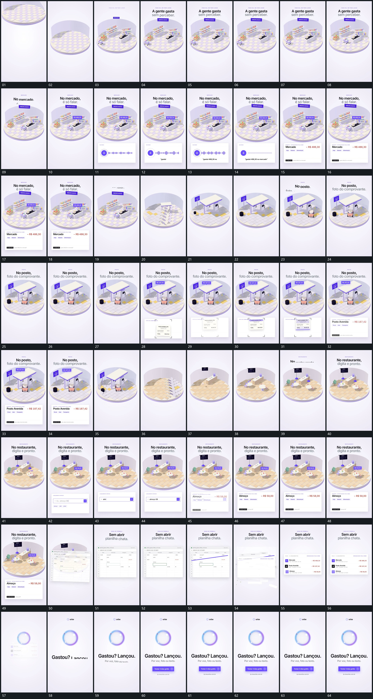

# 058 · 运动过程总览

## 运动总览

开头 [圆形底区接入，局部部件逐项建立，小形在内经过](mechanisms/m01.md) 接入圆形底区，再逐项建立后层与局部部件，小形在底区内经过。[固定片内短柱伸缩，文字逐字增加后结果片接替](mechanisms/m02.md) 下方固定片里短柱持续伸缩，文字逐字增加，完成后换成结果片。[侧方竖片带逐段翻过，覆盖旧组后新组同区接管](mechanisms/m03.md) 让竖向片带从侧方翻过，旧组随覆盖退去，新组在同一底区接管。

中段 [角框限定独立小片，局部横线顺序经过后换结果片](mechanisms/m04.md) 在下方片内接入独立小片，角框限定范围，局部横线按顺序经过，再换成结果片。又用 [侧方竖片带逐段翻过，覆盖旧组后新组同区接管](mechanisms/m03.md) 接入下一组，[长条逐字输入，完成后同位置短反馈片接替](mechanisms/m05.md) 让固定长条逐字输入，输入完成后短反馈片接替。后段大平面入场，[斜向长带经过大平面，内部布局接替后中央环形接管](mechanisms/m06.md) 斜向长带经过并替换内部布局，旧平面退虚，中央圆环接管，主字与附属条分项补齐收尾。

## 完整64宫格

按从左至右、从上至下阅读，覆盖全片首尾。具体运动分镜见各子机制。

## 原片与观察范围

[观看参考视频](video.mp4) · [原始来源](https://skillry.dev/ai-videos/opus-5-5/felipemoller-936736)

依据真实源帧总览及必要局部序列整理，仅描述可见运动、相对布局与接续。抽帧观察不等于原速连续观看或声音核验；不推定精确曲线、隐藏结构、作者源码或原始生成指令。迁移到新片仍需实现和预览。
