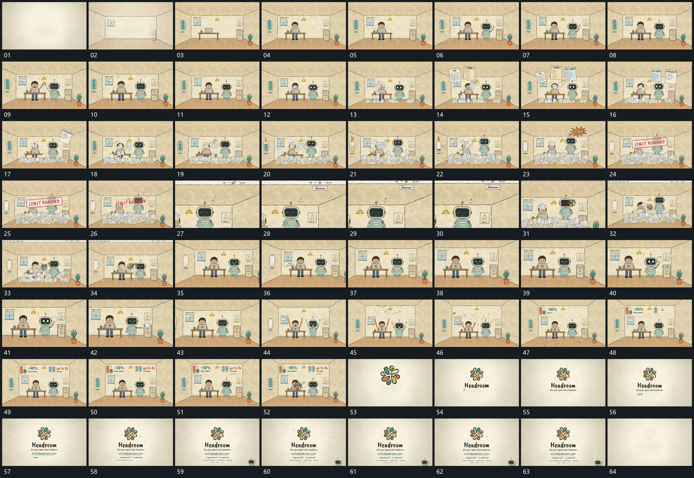

# 078 · 运动过程总览

## 运动总览

全片以[空空间先描边再依次放入底层与双组](mechanisms/m01.md)从空线框建立完整空间和两组形，继而[薄片错位经过后落到底部不断累积](mechanisms/m02.md)让多张薄片在上方错位经过、落到下部并不断累积。侧条随累积逐段减少，前层短标接入；[推向旁组局部后退回同一空间](mechanisms/m03.md)把视野推向旁组局部，再退回全貌。

新小形接入后用[多层堆积由上到下退去露出原空间](mechanisms/m04.md)逐层清空堆积，空间重新露出。[侧边端部伸出外提薄片再送回](mechanisms/m05.md)将旁侧薄片沿伸出的端部外提、保持、再送回；之后[散点从组上方展开侧条分段增长](mechanisms/m06.md)向上展开散点并让侧条重新增长。结尾以[局部小形放大接管空底再补结尾字行](mechanisms/m07.md)由局部小形放大接管空底，再逐行建立收尾文字。

## 完整64宫格

按从左至右、从上至下阅读，覆盖全片首尾。具体运动分镜见各子机制。

## 原片与观察范围

[观看参考视频](video.mp4) · [原始来源](https://skillry.dev/ai-videos/opus-5-5/garmdotcom-987439)

依据真实源帧总览及必要局部序列整理，仅描述可见运动、相对布局与接续。抽帧观察不等于原速连续观看或声音核验；不推定精确曲线、隐藏结构、作者源码或原始生成指令。迁移到新片仍需实现和预览。
