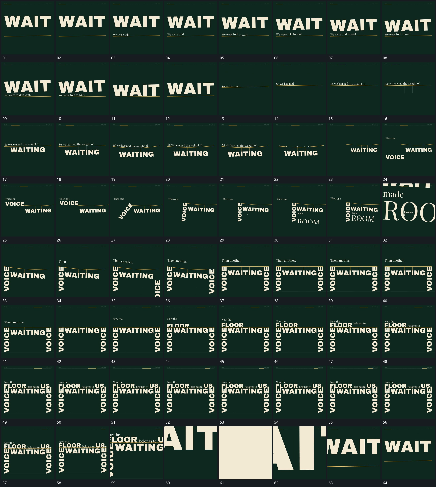

# 118 · 运动过程总览

## 运动总览

全片以一条横线持续充当共同参照。[新行从横线边逐段上移旧行沿同一边界退去](mechanisms/m01.md)在横线上逐段引入小行，中央大行随后以[大行落到横线回弹后向上退出](mechanisms/m02.md)落到线边、回弹并退出。新的小行复用[新行从横线边逐段上移旧行沿同一边界退去](mechanisms/m01.md)接入，下方大行改用[下方主行挂在线下下沉使横线中部弯曲](mechanisms/m03.md)挂在线下，让线形随它下沉而弯曲。

左侧新行上移到线边后，[侧行上移到线端固定一端转成竖向](mechanisms/m04.md)固定它靠线的一端，将横行转为竖行。下方补出带开口的大轮廓，[带开口轮廓放大取景穿入预先存在的内层](mechanisms/m05.md)让取景靠近开口中预先存在的同一排列，穿过开口后旧外框越界。右侧再以[另一侧竖行从下方上移接线使两端齐平](mechanisms/m06.md)上移接到线端，两侧竖行共同承托横线，线逐步变直。

上方几组新行复用[新行从横线边逐段上移旧行沿同一边界退去](mechanisms/m01.md)从线边接入，在线上累计成为完整排列，原有线下与两侧部分保持。末段[整组放大越界再从局部回退建立循环接点](mechanisms/m07.md)把整组放大至局部越界，再从覆盖的大形回退到开头的大行与横线，形成循环接点。保持段不另拆卡。

## 完整64宫格

按从左至右、从上至下阅读，覆盖全片首尾。具体运动分镜见各子机制。

## 原片与观察范围

[观看参考视频](video.mp4) · [原始来源](https://skillry.dev/ai-videos/opus-5-5/gdgtify-929495)

依据真实源帧总览及必要局部序列整理，仅描述可见运动、相对布局与接续。抽帧观察不等于原速连续观看或声音核验；不推定精确曲线、隐藏结构、作者源码或原始生成指令。迁移到新片仍需实现和预览。
