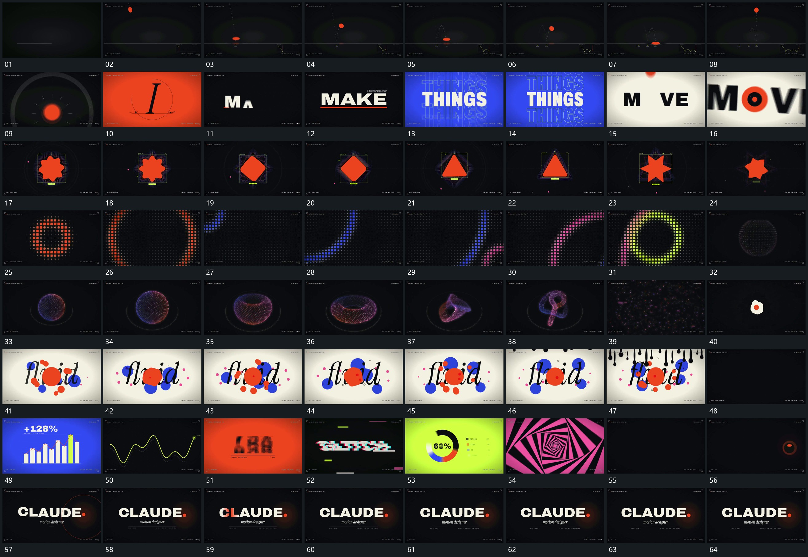

# 117 · 运动过程总览

## 运动总览

全片先用[小点落到承托线压扁再拉长回弹](mechanisms/m01.md)建立点与承托线的反复接触，再快速切入几组字行：[字片从下方错开进入主行底线随后延长](mechanisms/m02.md)让字片逐个从下方进入，[中央行保持上下复制行错开竖向流动](mechanisms/m03.md)让中央行与上下复制行形成相对运动。这几段以直接切换衔接，不把它们写成同一个持续变形。

中央形用[中央形连续变换轮廓外围轮廓延后跟随](mechanisms/m04.md)在固定中心连续改换轮廓，随后切到[固定格阵中的亮区形成轮廓并放大经过边界](mechanisms/m05.md)的格阵亮区，再切到[点群曲面由闭合球壳收成环再扭转散开](mechanisms/m06.md)的点群曲面。点群散开后，中央局部接到[中央片边缘伸缩外围片靠近聚合再分离](mechanisms/m07.md)的聚合与分离；上缘再以[上缘垂片向下延长接成覆盖面](mechanisms/m08.md)向下覆盖旧画面。

中后段快速展示[柱段沿同一底线依次升起连线跟随端点](mechanisms/m09.md)的柱段与连线、[端点沿曲线路径前进身后线逐步延长](mechanisms/m10.md)的路径端点、[固定柱组收回高段并重排高度形成阶梯](mechanisms/m11.md)的柱组高度重排、[固定窗口内的字片竖向滚动逐列停稳](mechanisms/m12.md)的窗口滚动、[主行被横向条带错开后回到完整排列](mechanisms/m13.md)的条带错位、[分段环沿同一圆周延长中心行同步收稳](mechanisms/m14.md)的分段环周延长和[嵌套角框绕共同中心持续转向](mechanisms/m15.md)的嵌套框转向。这些短过程之间多为直接切换，没有共同物体穿过所有段落。最后重新出现点与环，接回[字片从下方错开进入主行底线随后延长](mechanisms/m02.md)建立完整主行和下方附属行，保持结束。

## 完整64宫格

按从左至右、从上至下阅读，覆盖全片首尾。具体运动分镜见各子机制。

## 原片与观察范围

[观看参考视频](video.mp4) · [原始来源](https://skillry.dev/ai-videos/opus-5-5/ghinaiya-nirmal-308943)

依据真实源帧总览及必要局部序列整理，仅描述可见运动、相对布局与接续。抽帧观察不等于原速连续观看或声音核验；不推定精确曲线、隐藏结构、作者源码或原始生成指令。迁移到新片仍需实现和预览。
