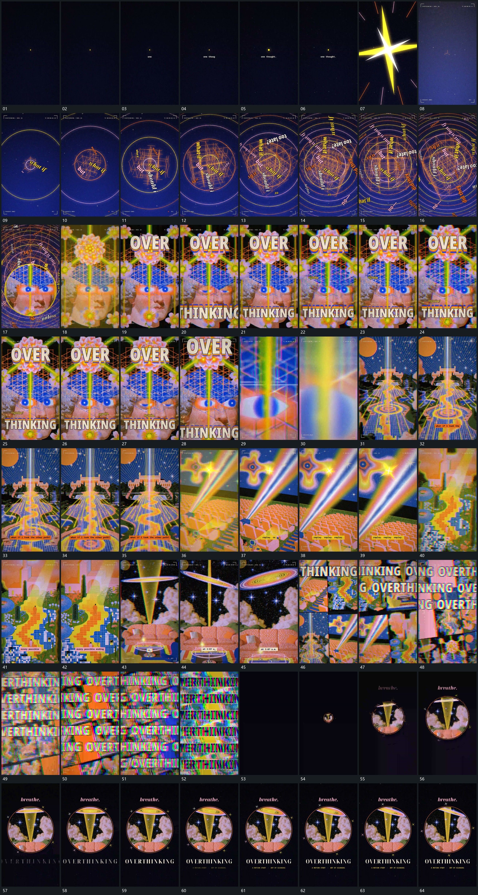

# 072 · 运动过程总览

## 运动总览

全片从单点开始，以[点下方补字再由中心放射覆盖](mechanisms/m01.md)让短字接入并用放射覆盖打开下一层。随后[环网格累积并让短字沿不同方向绕行](mechanisms/m02.md)逐步增加环、网格和绕行短字，中心窗口引入图块，接到[前层大字分段建立而后层继续活动](mechanisms/m03.md)的前层文字建立与后层持续活动。

文字放大越界后，[推入中心网格并穿过模糊遮挡接管新空间](mechanisms/m04.md)沿中心通道推入并穿过遮挡，转到新的纵深空间；其中的平面与短条继续接替。[椭圆盘围中心改变倾角](mechanisms/m05.md)在稳定中心下改变椭圆盘的倾角，再以[多片并置后多排字错位铺满](mechanisms/m06.md)让多片和多行同时铺开、错位经过。集合退净后，[集合退净后圆窗口由小放大并补下方字行](mechanisms/m07.md)用小圆窗口逐步放大收尾，窗口内复用[椭圆盘围中心改变倾角](mechanisms/m05.md)，下方文字分项补齐。

## 完整64宫格

按从左至右、从上至下阅读，覆盖全片首尾。具体运动分镜见各子机制。

## 原片与观察范围

[观看参考视频](video.mp4) · [原始来源](https://skillry.dev/ai-videos/opus-5-5/gizakdag-239768)

依据真实源帧总览及必要局部序列整理，仅描述可见运动、相对布局与接续。抽帧观察不等于原速连续观看或声音核验；不推定精确曲线、隐藏结构、作者源码或原始生成指令。迁移到新片仍需实现和预览。
