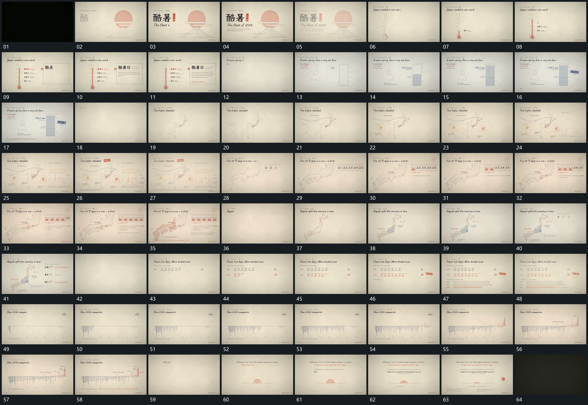

# 052 · 运动过程总览

## 运动总览

开头轮廓、主字与附属行逐项建立后退弱。[竖向刻度先立轮廓，沿轴上填后追加旁行与侧片](mechanisms/m01.md) 先立竖向刻度轮廓，再沿轴上填，旁侧短行逐项追加，右片接入并补齐内容。[立形内由下上填，数值增长后局部短标记接入](mechanisms/m02.md) 在另一空立形内由下向上填充，数值增加，局部标记稍后到位。

中段 [大轮廓逐段描出，弧线与局部环形错峰接续](mechanisms/m03.md) 从少量线段描出大轮廓，再延伸弧向线，环形局部与侧边箭头结构接续。[一排空格逐项填字符，再依次补标记，旁点同步增加](mechanisms/m04.md) 让一排空格逐项填入字符，再按顺序添加短标记，旁轮廓上的点与下部短行同步增加。[轮廓内部区域分块填入，旁标签与横条接续](mechanisms/m05.md) 将轮廓内部区域分块填入，旁侧标签和横条随后补齐。

后段 [短笔画累计成行，数值增长，下一行与附属横条随后建立](mechanisms/m06.md) 以短笔画累计成行，数值增长，完成一行后再建下行，附属横条延长。[沿共同基线逐项补竖条，末端曲线与高点标记后到](mechanisms/m07.md) 沿共同基线从左向右补入竖条，末端曲线与高点标记随后建立。最后旧组退去，中央字组分行补齐，底部半圆缩小并退去，附属说明保持结束。

## 完整64宫格

按从左至右、从上至下阅读，覆盖全片首尾。具体运动分镜见各子机制。

## 原片与观察范围

[观看参考视频](video.mp4) · [原始来源](https://skillry.dev/ai-videos/opus-5-5/groundcontrol-230877)

依据真实源帧总览及必要局部序列整理，仅描述可见运动、相对布局与接续。抽帧观察不等于原速连续观看或声音核验；不推定精确曲线、隐藏结构、作者源码或原始生成指令。迁移到新片仍需实现和预览。
