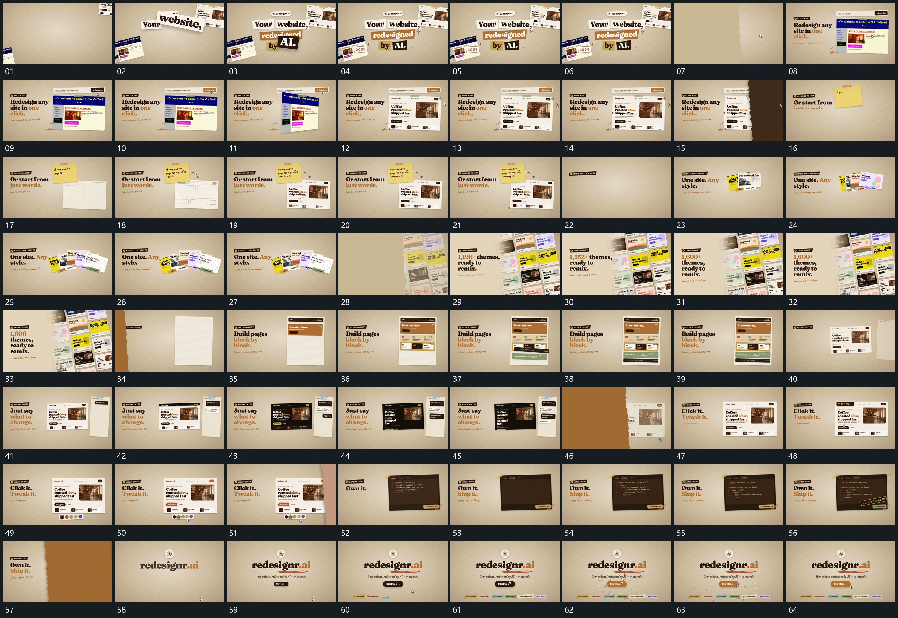

# 029 · 运动过程总览

## 运动总览

开头 [短字片错开叠入，组成中央完整句组](mechanisms/m01.md) 让短字片错开叠入，中部组形完整后外围片退去。[竖向分界换内图，侧方不齐边缘覆盖接替下一组](mechanisms/m02.md) 在同一框面内以竖向分界替换内容，随后不齐边缘的覆盖从侧边经过，换入新布局。

中段 [虚线槽逐项建立，内部图文随后补齐](mechanisms/m03.md) 先立空框与虚线槽，再依次补入各区内容。短片扇形展开后满幅倾斜集合接管，数值在旁侧增长。[横块从上到下分批落位，固定长片逐段填满](mechanisms/m04.md) 在固定长片上从上到下逐项填入横块，后块接入时前块保持。

之后并置框内内容更新，局部小条接续出现。收尾再次使用 [竖向分界换内图，侧方不齐边缘覆盖接替下一组](mechanisms/m02.md) 的边缘覆盖，固定框内文字逐字增加，[短线先延长，长条与小标签错开补齐](mechanisms/m05.md) 先画短下划线，再建立长条和下方小标签，短反馈散片退出后保持。

## 完整64宫格

按从左至右、从上至下阅读，覆盖全片首尾。具体运动分镜见各子机制。

## 原片与观察范围

[观看参考视频](video.mp4) · [原始来源](https://skillry.dev/ai-videos/opus-5-5/helloshiva0801-438284)

依据真实源帧总览及必要局部序列整理，仅描述可见运动、相对布局与接续。抽帧观察不等于原速连续观看或声音核验；不推定精确曲线、隐藏结构、作者源码或原始生成指令。迁移到新片仍需实现和预览。
