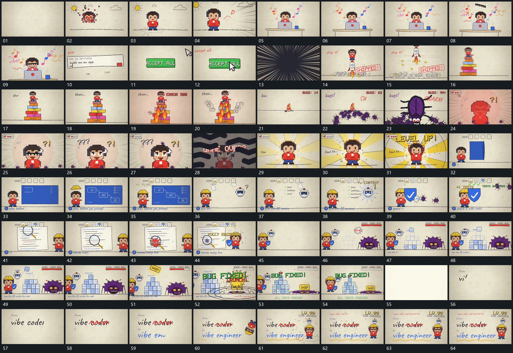

# 083 · 运动过程总览

## 运动总览

全片先用[分散小方片向中心收集成完整主形](mechanisms/m01.md)把分散小方片收成完整主形，接到稳定底层与多项外围变化。中央局部推近后，以[放射长线从外围向中心经过并覆盖换场](mechanisms/m02.md)的放射线覆盖换场，[细长主形向上送出底部圈与小片散开](mechanisms/m03.md)把细长主形向上送出并在下方留下扩散圈。

下一组由多块叠起，[多个小形从下缘接近并增大铺向前层](mechanisms/m04.md)让多个小形从下缘接近、增大并铺向前层，再用[放射长线从外围向中心经过并覆盖换场](mechanisms/m02.md)覆盖接管。中心新主形由[中央主形保持接点向外展开圈带并抬起](mechanisms/m05.md)向外展开圈带并抬起。中段[框内节点先建立连线逐段接上侧项补齐](mechanisms/m06.md)在大框中补节点、连线与侧项；[旁侧薄片分次靠近中心留下累积条目](mechanisms/m07.md)让旁侧片面分次向中心靠近，接上[圈形指示沿多行移动到目标后局部展开](mechanisms/m08.md)的圈形指示移动与局部强调。

后段[方片逐层落入并堆成台阶阵列](mechanisms/m09.md)将方片逐层叠成阵列，[大块下压旁形后局部压扁扩散阵列逐项更新](mechanisms/m10.md)让大块下压旁形并带动局部压扁、扩散和逐项更新。结尾[短行描入划过局部再接下行与旁形](mechanisms/m11.md)先描短行再划掉局部，接入下行和旁形，保持完整结果。

## 完整64宫格

按从左至右、从上至下阅读，覆盖全片首尾。具体运动分镜见各子机制。

## 原片与观察范围

[观看参考视频](video.mp4) · [原始来源](https://skillry.dev/ai-videos/opus-5-5/henritoivar-445215)

依据真实源帧总览及必要局部序列整理，仅描述可见运动、相对布局与接续。抽帧观察不等于原速连续观看或声音核验；不推定精确曲线、隐藏结构、作者源码或原始生成指令。迁移到新片仍需实现和预览。
