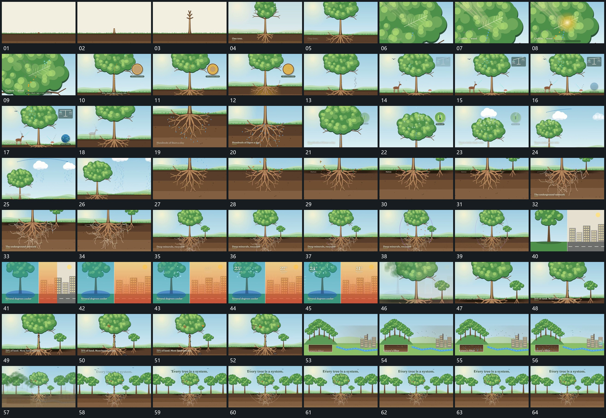

# 080 · 运动过程总览

## 运动总览

全片由[细长主形跨底线伸展并逐次长出分支](mechanisms/m01.md)从底线附近生长出上下分支与上部展开区。随后[围同一主轴推入局部再沿纵向转移取景](mechanisms/m02.md)推入上部局部，再退回全貌，并多次沿纵向转向下部和上部。[小点沿已有支路连续经过并接上局部圈](mechanisms/m03.md)让小点沿已有枝状路径流动，支路与圆区保持。

下部新增细支使用[细支从多个端点延长并互相接成网](mechanisms/m04.md)逐段延长并接成网状范围；上方弧线与下落短点仍复用[小点沿已有支路连续经过并接上局部圈](mechanisms/m03.md)。中段[左右片面依次占区局部短值分别接替](mechanisms/m05.md)让左右片面分开建立，再在两侧更新局部短值。最后[退镜保留原组并让更多组分层补齐](mechanisms/m06.md)退镜露出更多并列组，保留原组作为中央参照并补结尾短行。

## 完整64宫格

按从左至右、从上至下阅读，覆盖全片首尾。具体运动分镜见各子机制。

## 原片与观察范围

[观看参考视频](video.mp4) · [原始来源](https://skillry.dev/ai-videos/opus-5-5/hunzai-842605)

依据真实源帧总览及必要局部序列整理，仅描述可见运动、相对布局与接续。抽帧观察不等于原速连续观看或声音核验；不推定精确曲线、隐藏结构、作者源码或原始生成指令。迁移到新片仍需实现和预览。
