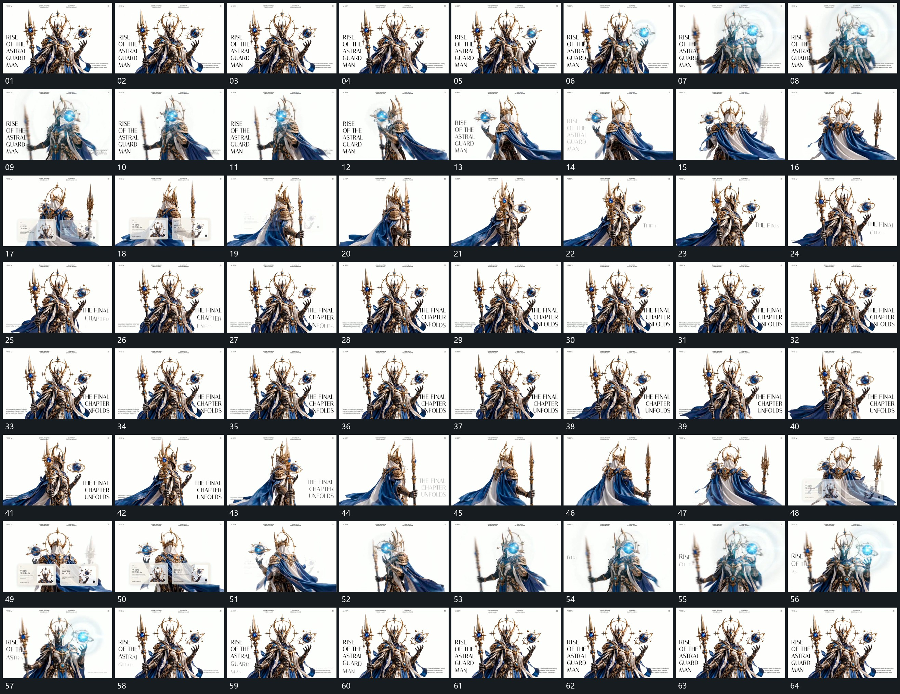

# 095 · 运动过程总览

## 运动总览

全片保持同一主组，[主组连续转向正侧背面附属长片滞后摆动](mechanisms/m01.md)围组形连续改变正侧背面，附属长片始终有局部摆动。[小圆外围环带在转向中扩大并绕行后收近](mechanisms/m02.md)在主组旁的小圆周围增加环带，并在转向中扩大又收近。

前层内容以[侧边字列分行建立保持后整体退弱](mechanisms/m03.md)分行建立、保持再退去，必要时[两张小片面并列接入后共同退去](mechanisms/m04.md)加入并列小片面后共同退出。正面与背面来回时重复使用同一组机制，结尾回到首段字列与原主组位置。

## 完整64宫格

按从左至右、从上至下阅读，覆盖全片首尾。具体运动分镜见各子机制。

## 原片与观察范围

[观看参考视频](video.mp4) · [原始来源](https://skillry.dev/ai-videos/opus-5-5/iamtanzil-675031)

依据真实源帧总览及必要局部序列整理，仅描述可见运动、相对布局与接续。抽帧观察不等于原速连续观看或声音核验；不推定精确曲线、隐藏结构、作者源码或原始生成指令。迁移到新片仍需实现和预览。
