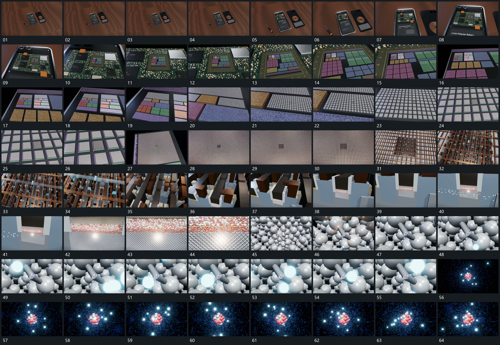

# 100 · 运动过程总览

## 运动总览

全片从双片并置的远景开始，[从并置全貌锁定一片连续推入多级局部](mechanisms/m01.md)连续推向一片内部，再逐级进入网格、短杆和小球阵列。靠近中层时[上方格状层退让下方短杆阵列接管](mechanisms/m02.md)退让上方格状层，露出下部小组；[小点沿局部通道连续经过并越出一侧](mechanisms/m03.md)让小点沿同一局部通道连续经过。

到更细球层后继续复用[从并置全貌锁定一片连续推入多级局部](mechanisms/m01.md)，进入其中一处短连接。末段[周边连接退去中央球组留下外围点继续经过](mechanisms/m04.md)把周围连接与球层退去，只留中央小球组，外围小点围其持续经过，取景到稳定范围后保持。

## 完整64宫格

按从左至右、从上至下阅读，覆盖全片首尾。具体运动分镜见各子机制。

## 原片与观察范围

[观看参考视频](video.mp4) · [原始来源](https://skillry.dev/ai-videos/opus-5-5/irinatoxi-962937)

依据真实源帧总览及必要局部序列整理，仅描述可见运动、相对布局与接续。抽帧观察不等于原速连续观看或声音核验；不推定精确曲线、隐藏结构、作者源码或原始生成指令。迁移到新片仍需实现和预览。
