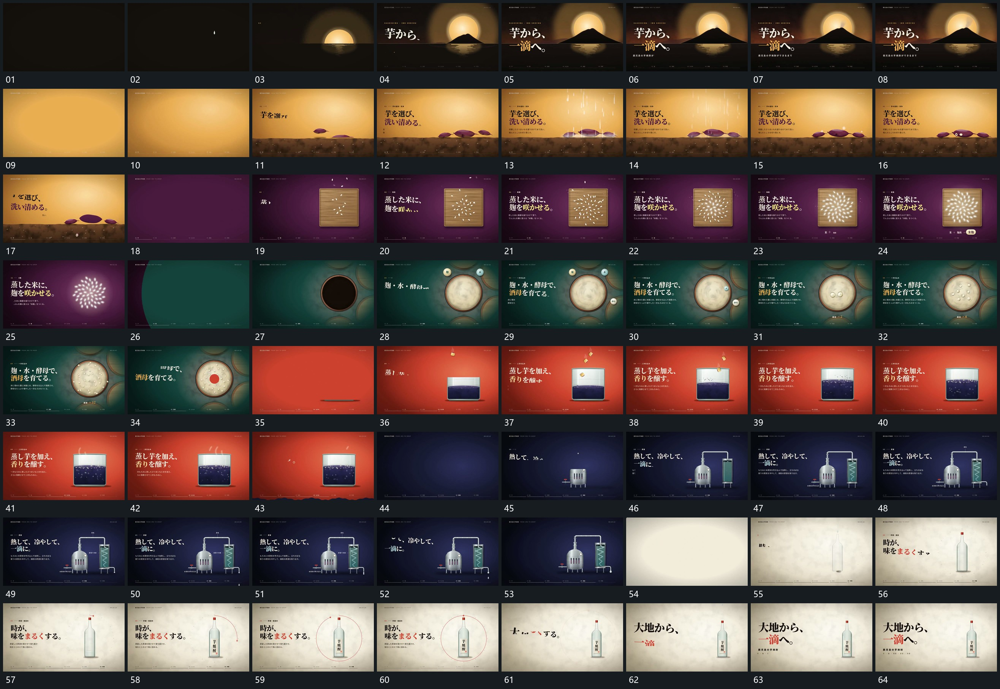

# 084 · 运动过程总览

## 运动总览

全片先由[小滴落到平面圈形展开圆区随后上升](mechanisms/m01.md)的小滴下落与圈形展开引出上升圆区，随后[推入圆区使边界越界接管全幅](mechanisms/m02.md)推入圆区，使其越界接管新底。[小片从上方错开落定短竖线随后经过](mechanisms/m03.md)在固定横向承载面上分次送入小片，短竖线随后从上方经过。

下一段[细小片落入方区累积外框退去留下集合](mechanisms/m04.md)让细小片从上方落入方形范围并累积；外框退去，内部集合留下。[大圆边界横向经过覆盖原层并换底](mechanisms/m05.md)以大圆边界横向覆盖换底，接入[小圆围大圆靠近接入内部小圈逐次增加](mechanisms/m06.md)的小圆围绕大圆靠近、内部小圈逐次增加。后段[方块从上方落入下区并伴随区域增高](mechanisms/m07.md)把方块送入下区并让下区增高，再接[外部连通轮廓先延长内部折线再逐段描出](mechanisms/m08.md)的连通轮廓与内部折线逐段建立。结尾换底后细长形建立，[围细长形描出完整圆圈字行分段建立](mechanisms/m09.md)沿其外围描圈，旁侧字行分段补齐。

## 完整64宫格

按从左至右、从上至下阅读，覆盖全片首尾。具体运动分镜见各子机制。

## 原片与观察范围

[观看参考视频](video.mp4) · [原始来源](https://skillry.dev/ai-videos/opus-5-5/itakahashikun-990109)

依据真实源帧总览及必要局部序列整理，仅描述可见运动、相对布局与接续。抽帧观察不等于原速连续观看或声音核验；不推定精确曲线、隐藏结构、作者源码或原始生成指令。迁移到新片仍需实现和预览。
