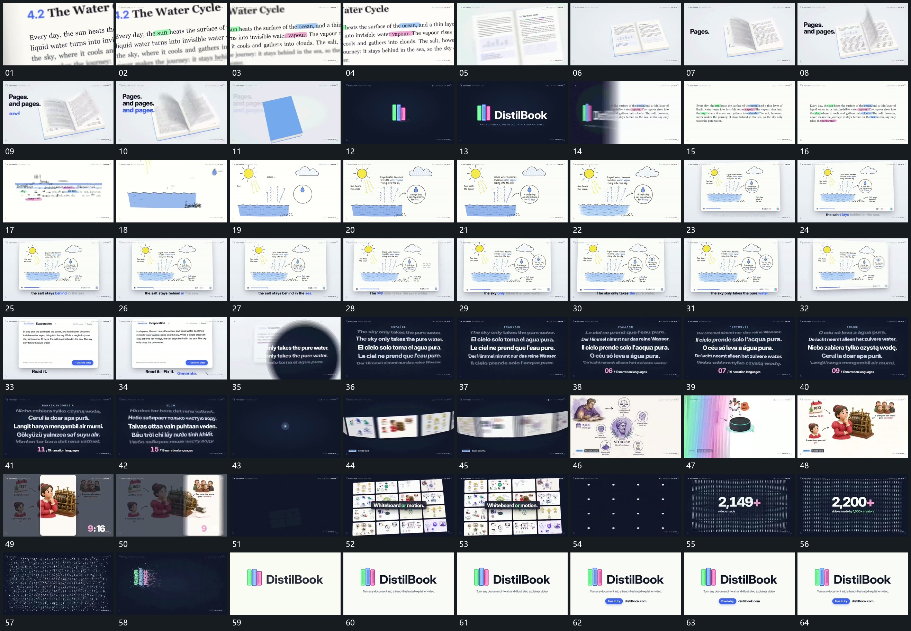

# 057 · 运动过程总览

## 运动总览

开场 [近景字面逐项建立强调，退镜后保留字面为整体片](mechanisms/m01.md) 在近景字面中逐项建立强调，随后退镜到双片并置。[多层平面绕中轴依次翻过，侧字分行增加后整面合拢](mechanisms/m02.md) 让多层平面绕中轴翻过，侧字逐行追加，末尾整面合拢；标记与字组短暂接管。原字面回来，[字面收散，原区域图形轮廓分批补出](mechanisms/m03.md) 将字面收散并在原区域补出图形轮廓，[主形先建立，分支线和局部圈依次补齐](mechanisms/m04.md) 从先立主形到分支线、局部圈与附属短行逐项建立完整关系图。

图形组缩到新框内，沿用 [近景字面逐项建立强调，退镜后保留字面为整体片](mechanisms/m01.md) 推进下方短句的局部强调。下一片接管后 [圆形覆盖扩张换底，纵向字行轮换，中央行突出](mechanisms/m05.md) 从局部圆形覆盖扩张换底，字行沿纵向轮换，中央行突出，前后行退弱。[图片条带沿弧面侧向经过，选定平面接管满幅](mechanisms/m06.md) 让图片条带沿弧面侧向经过，再进入一张完整片。[完整片面限定竖向可见区，外部退暗后改变窗口形态](mechanisms/m07.md) 在全片前限定竖向可见区，外部退暗，随后改变可见区形态。

末段 [多片铺成网格，再收成小点阵，中央数值持续增长](mechanisms/m08.md) 多片逐项铺成网格，再收成小点阵，数值建立并增加。[点阵打散再汇成中央短形，短字和附属条接续](mechanisms/m09.md) 将点阵打散，再收成中央短形，主字和附属条接上，结束保持。

## 完整64宫格

按从左至右、从上至下阅读，覆盖全片首尾。具体运动分镜见各子机制。

## 原片与观察范围

[观看参考视频](video.mp4) · [原始来源](https://skillry.dev/ai-videos/opus-5-5/itisrazak-332386)

依据真实源帧总览及必要局部序列整理，仅描述可见运动、相对布局与接续。抽帧观察不等于原速连续观看或声音核验；不推定精确曲线、隐藏结构、作者源码或原始生成指令。迁移到新片仍需实现和预览。
