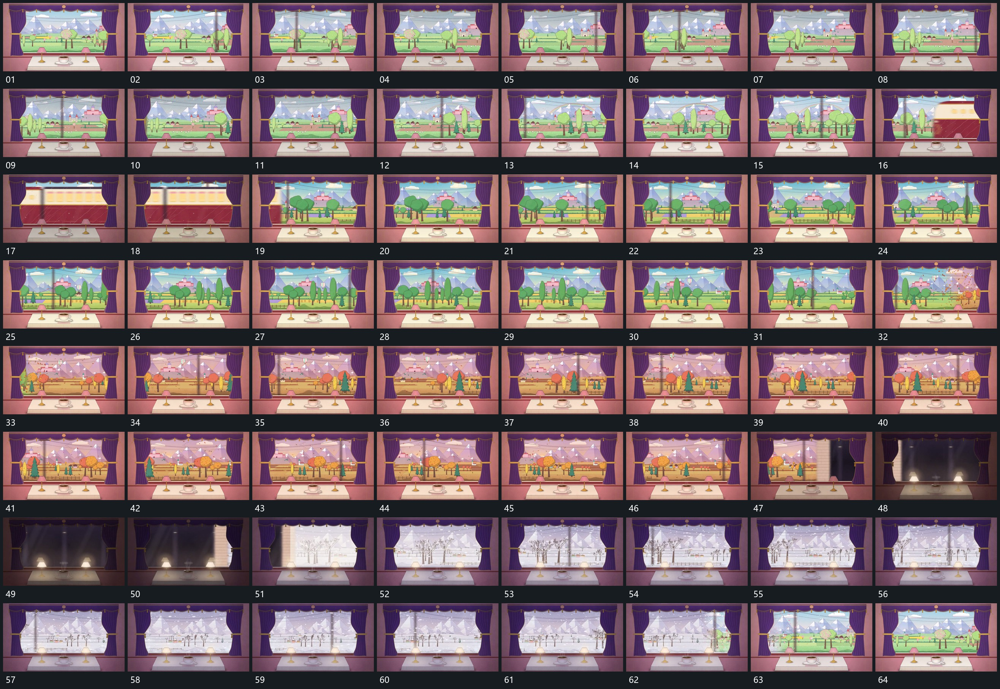

# 062 · 运动过程总览

## 运动总览

全片以固定前层窗口为持续边界。[固定窗口内远近层同向经过，近层较快，前层保持](mechanisms/m01.md) 在窗口内让远近层同向经过，近层移动较快，前层位置保持。[宽长片侧向横穿窗口，遮住后层后退出](mechanisms/m02.md) 宽长片从侧边进入，横穿窗口遮住后层后退出，原空间继续活动。

中段 [散小片从侧方进入，新后层逐步接管固定窗口](mechanisms/m03.md) 从侧方接入散小片和替代状态，让新后层逐步接管窗口，前层边界不动。[整窗覆盖侧向经过，前层减弱后恢复，新后层显露](mechanisms/m04.md) 用整窗覆盖从一侧经过，前层局部整体减弱，覆盖退出后新后层显露，前层恢复；新后层中的小点持续下落。末段再次使用 [散小片从侧方进入，新后层逐步接管固定窗口](mechanisms/m03.md) 从侧方替换后层，回到起始状态形成循环。

## 完整64宫格

按从左至右、从上至下阅读，覆盖全片首尾。具体运动分镜见各子机制。

## 原片与观察范围

[观看参考视频](video.mp4) · [原始来源](https://skillry.dev/ai-videos/opus-5-5/itsolelehmann-762215)

依据真实源帧总览及必要局部序列整理，仅描述可见运动、相对布局与接续。抽帧观察不等于原速连续观看或声音核验；不推定精确曲线、隐藏结构、作者源码或原始生成指令。迁移到新片仍需实现和预览。
