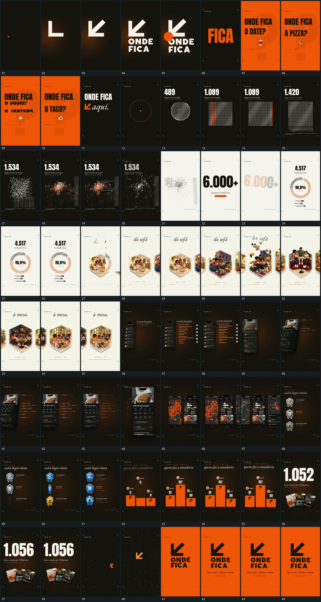

# 026 · 运动过程总览

## 运动总览

片头 [小点延成折角线，斜段加入后圆层扩张换底](mechanisms/m01.md) 从小点建立折角线与斜段，字组接上，再用圆层扩张换底。短句轮换后 [圆形点阵重排为方阵，扫描带经过后底部散出](mechanisms/m02.md) 将点阵从圆形改为规则方阵，竖向扫描带经过，底边点向外散开。

中段 [点群散开，带竖线重排后聚合成大字或圆环](mechanisms/m03.md) 保留点群，散开后重排成带竖向短线的分布，再聚合成大字或环形。随后 [立体片横向轮换，内部部件散开后归位](mechanisms/m04.md) 在并置立体片中横向轮换当前项，内部若干部件分散后重新归位。

后段进入竖框，[竖框倾转靠近，侧边标注接力建立后缩排](mechanisms/m05.md) 让同一框倾转推近，旁侧标注逐项接入，之后缩排成多框集合。最后 [柱形高度增长，数值随过程累加停稳](mechanisms/m06.md) 在并列柱形中同时增长高度与数值，结果留场后再接大数字、倾斜片组和中心标记。

## 完整64宫格

按从左至右、从上至下阅读，覆盖全片首尾。具体运动分镜见各子机制。

## 原片与观察范围

[观看参考视频](video.mp4) · [原始来源](https://skillry.dev/ai-videos/opus-5-5/jesscaroline7-955094)

依据真实源帧总览及必要局部序列整理，仅描述可见运动、相对布局与接续。抽帧观察不等于原速连续观看或声音核验；不推定精确曲线、隐藏结构、作者源码或原始生成指令。迁移到新片仍需实现和预览。
