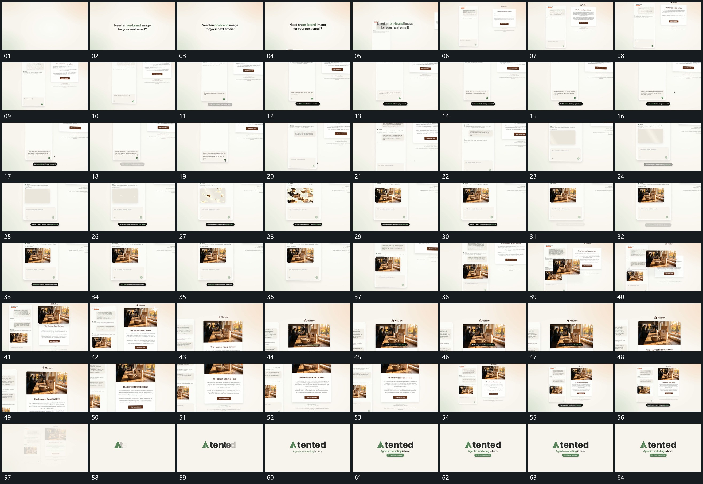

# 025 · 运动过程总览

## 运动总览

开头两行字组建立，[并置长框接入，内部文字逐字增加](mechanisms/m01.md) 从不同空位接入并置长框，原字退出后框内输入逐字增加。中段 [图像从零散块面逐步显出，补齐固定范围](mechanisms/m02.md) 在固定图像区域先用零散块面显出，再补齐整幅，外框与旁侧内容保持。

接着 [内部图像提为前景片，跨到旁框后归入内部](mechanisms/m03.md) 从内部提起图像作为独立前景片，移到旁框上方，来源处仍保留内容；前片收回后图像出现在旁框内部。之后 [并置框共同靠近，旁片接续后缩回整体](mechanisms/m04.md) 使并置框共同推近与横移，侧卡接续补入，再缩回完整布局。末尾整组减淡，标记与短行逐项建立。

## 完整64宫格

按从左至右、从上至下阅读，覆盖全片首尾。具体运动分镜见各子机制。

## 原片与观察范围

[观看参考视频](video.mp4) · [原始来源](https://skillry.dev/ai-videos/opus-5-5/justincooperman-188876)

依据真实源帧总览及必要局部序列整理，仅描述可见运动、相对布局与接续。抽帧观察不等于原速连续观看或声音核验；不推定精确曲线、隐藏结构、作者源码或原始生成指令。迁移到新片仍需实现和预览。
