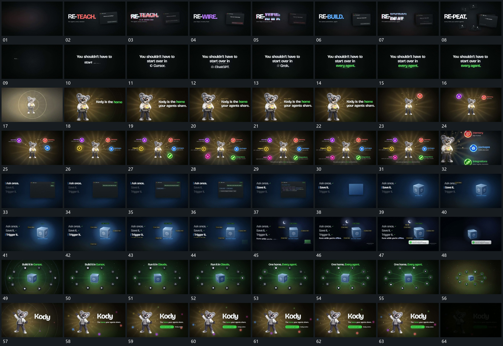

# 069 · 运动过程总览

## 运动总览

开头 [主字短暂错位叠影后接替下一组，旁片同步更新](mechanisms/m01.md) 让主字短暂错位叠影，接替成下一字组，旁片同时更新。中央字组分行建立，[环形后层展开，一侧主形保持，旁字逐行补齐](mechanisms/m02.md) 保留一侧主形，环形后层展开，旁字逐行补齐。[主形缩回中央，外围圆点逐项加入并连接到中心](mechanisms/m03.md) 让主形缩小回中部，外围圆点逐项加入，连接线从中心延到各点。

中段 [固定片内内容逐行增加，片面收成方块后转角](mechanisms/m04.md) 固定片中气泡和正文逐行增加，完成后片面收成方块，方块转角并建立几面轮廓。[方块持续转动，外围短标签分项加入，反馈条后接](mechanisms/m05.md) 方块保持转动，周边短标签分项加入，以细线连接，下方反馈条最后出现。后段 [外围点环先建立，连线逐项补齐，中心主形保持活动](mechanisms/m06.md) 外围点环先立，连接线逐项补齐，中心方块持续小幅转动。末段整组缩回，主形与字组接管，外围小点继续经过，附属行与底条补齐后退暗。

## 完整64宫格

按从左至右、从上至下阅读，覆盖全片首尾。具体运动分镜见各子机制。

## 原片与观察范围

[观看参考视频](video.mp4) · [原始来源](https://skillry.dev/ai-videos/opus-5-5/kentcdodds-858193)

依据真实源帧总览及必要局部序列整理，仅描述可见运动、相对布局与接续。抽帧观察不等于原速连续观看或声音核验；不推定精确曲线、隐藏结构、作者源码或原始生成指令。迁移到新片仍需实现和预览。
