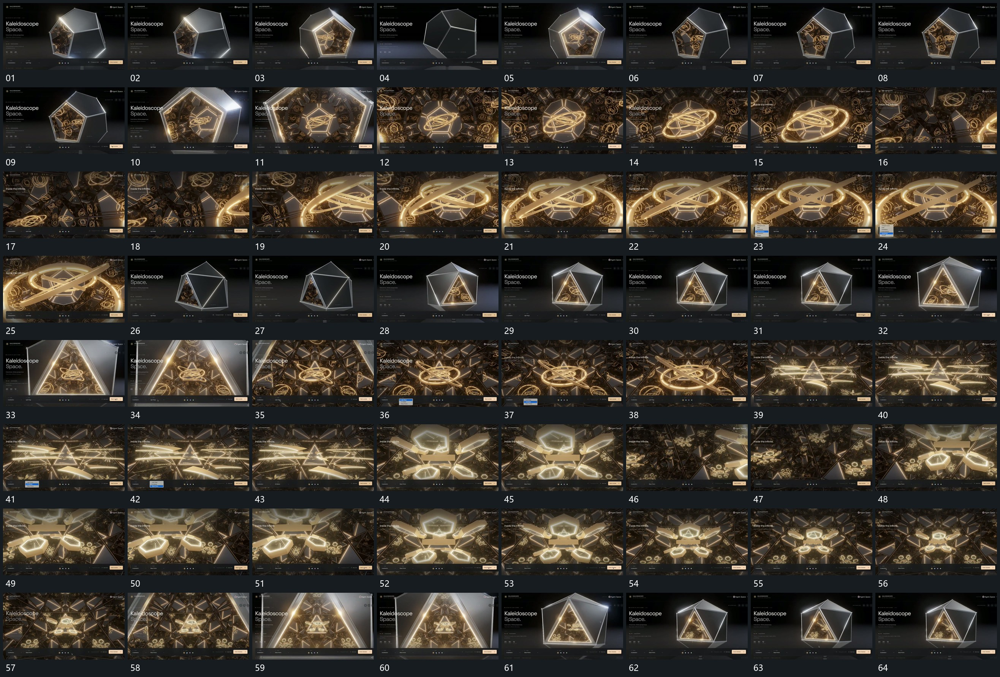

# 104 · 运动过程总览

## 运动总览

全片先用[多面组围中心转向使选定开口朝前](mechanisms/m01.md)让多面组围中心转向，选定的开口朝向取景后，[沿开口推入重复结构后反向退出外部](mechanisms/m02.md)沿开口推进，外围边界越界，内部重复结构接管。内部[多个倾角环围共同中心持续转向](mechanisms/m03.md)让多个倾角环围共同中心持续转向，取景在近处小幅转角。

退回外部后再次复用[多面组围中心转向使选定开口朝前](mechanisms/m01.md)与[沿开口推入重复结构后反向退出外部](mechanisms/m02.md)进入另一边界形态；内部改用[多个短片围中心展开并连续改变倾角](mechanisms/m04.md)，多个短片围中心展开并持续改变倾角。最后沿[沿开口推入重复结构后反向退出外部](mechanisms/m02.md)反向退出，回到外部全貌，重复段不增加新卡。

## 完整64宫格

按从左至右、从上至下阅读，覆盖全片首尾。具体运动分镜见各子机制。

## 原片与观察范围

[观看参考视频](video.mp4) · [原始来源](https://skillry.dev/ai-videos/opus-5-5/kewai386772-276947)

依据真实源帧总览及必要局部序列整理，仅描述可见运动、相对布局与接续。抽帧观察不等于原速连续观看或声音核验；不推定精确曲线、隐藏结构、作者源码或原始生成指令。迁移到新片仍需实现和预览。
