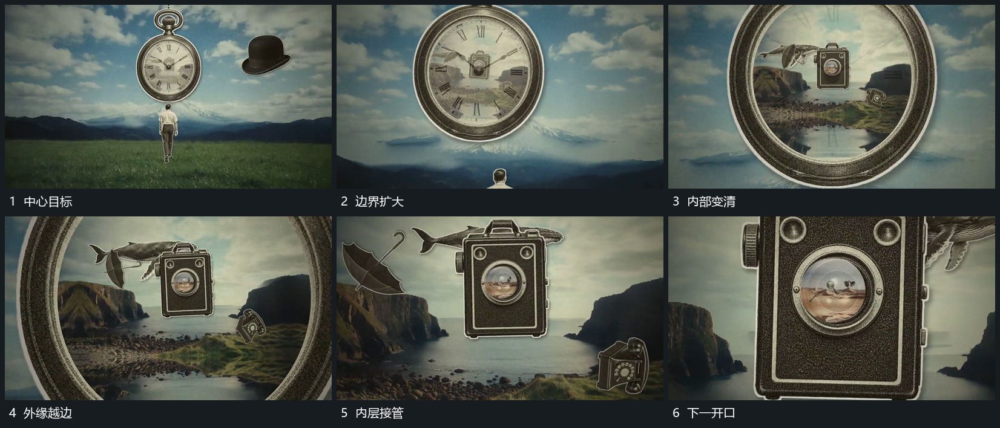

# 向中心开口持续推进，内层扩大成为下一场

## 运动指令

将推进方向持续对准中心开口，让开口连同边界逐渐变大，内部的新层同步变得清楚。最初内部纹理逐渐退去，新层显出；接近时边界越来越靠近四周，最终越出画外，由原本的内部内容接管全幅。下一层仍保留可继续进入的中心目标，使推进可以重复。

## 分镜过程

## 组合与调整

改变开口形状和推进速度时，保持中心接点可追踪，内层不要到最后才硬切出现。原片多次复用这一关系，末尾回到近似开场布局；未据此认定像素级无缝循环。
