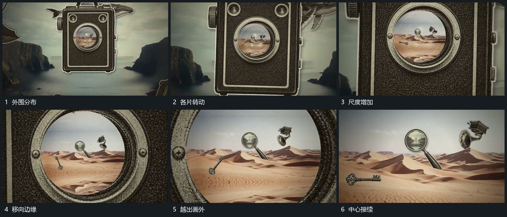

# 外围片层自转并向边缘越出，让出中心通道

## 运动指令

在向中心推进的同时，让外围片层各自转动、变大，并逐渐越出最近的画边。不同片层的运动不完全同步，中心目标继续可见；靠近的片先退出，较远的片稍后退出，留下通向下一层的空隙。不要把全部内容烘成一张平面后统一缩放。

## 分镜过程

## 组合与调整

可调整外围层数量和旋转方向，保留前后错开和中心通道。这是推进中的伴随关系，可与中心穿越叠用；没有中心目标时单用会失去明确去向。
