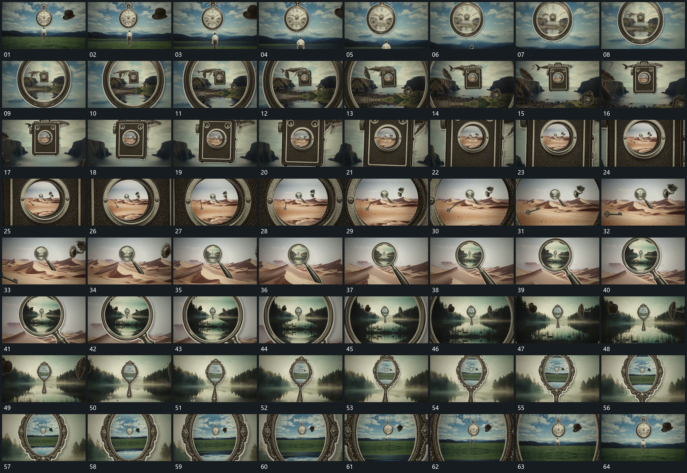

# 012 · 运动过程总览

## 运动总览

全片以 [向中心开口持续推进，内层扩大成为下一场](mechanisms/m01.md) 为主：中心开口先露出下一层，向内推进后外缘越出，原内层成为新的整幅画面。进入后又遇到新的圆形或椭圆形入口，再重复推进，并非每次穿越都需要一条新机制。

推进期间 [外围片层自转并向边缘越出，让出中心通道](mechanisms/m02.md) 与它交叠，外围片层旋转、放大、向边缘离场，使中心始终保持可进入的通道。几轮接管以后，最后一个开口里出现近似开场的布局；推进至片尾时回到这一构图。此处记录的是构图回归，不把它表述成已确认的无缝循环。

## 完整64宫格

按从左至右、从上至下阅读，覆盖开头到结尾；用于查看全片发展，具体机制已在各自文档中配分镜。

## 原片与观察范围

[观看参考视频](video.mp4) · [原始来源](https://skillry.dev/ai-videos/opus-5-5/koldo2k-778767)

本次依据真实源帧的完整总览、密集序列及必要局部补帧整理，仅记录可见运动与接续。抽帧观察不等于原速连续观看或声音核验；不据此指定精确曲线、隐藏结构、作者源码或原始生成指令。机制可迁移，具体实现仍需在新片中预览检验。
