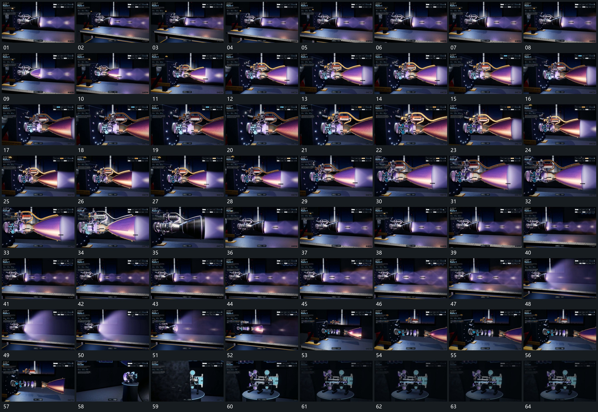

# 099 · 运动过程总览

## 运动总览

全片围同一横向组形，以[围横向组形转角推近再退回](mechanisms/m01.md)小幅转角与推退观察。[固定开口送出带状层局部反复收窄扩张](mechanisms/m02.md)在固定开口处持续送出向侧方延长的带状层，沿带周期出现局部收窄和扩张。

内部段落[近侧外层逐步退让露出内部再合回](mechanisms/m03.md)逐步退让近侧外层，露出同轴结构，再把外层接回。末段[同轴圆片与端部沿轴向逐层拉开](mechanisms/m04.md)把同轴多个圆片和端部沿轴向拉开，原带状运动继续；随后[围横向组形转角推近再退回](mechanisms/m01.md)转向旁侧小组，[局部圆片围固定轴转动旁层保持](mechanisms/m05.md)让其局部圆片围各自轴持续转动，结束在近处保持。

## 完整64宫格

按从左至右、从上至下阅读，覆盖全片首尾。具体运动分镜见各子机制。

## 原片与观察范围

[观看参考视频](video.mp4) · [原始来源](https://skillry.dev/ai-videos/opus-5-5/konstantinsaifo-501736)

依据真实源帧总览及必要局部序列整理，仅描述可见运动、相对布局与接续。抽帧观察不等于原速连续观看或声音核验；不推定精确曲线、隐藏结构、作者源码或原始生成指令。迁移到新片仍需实现和预览。
