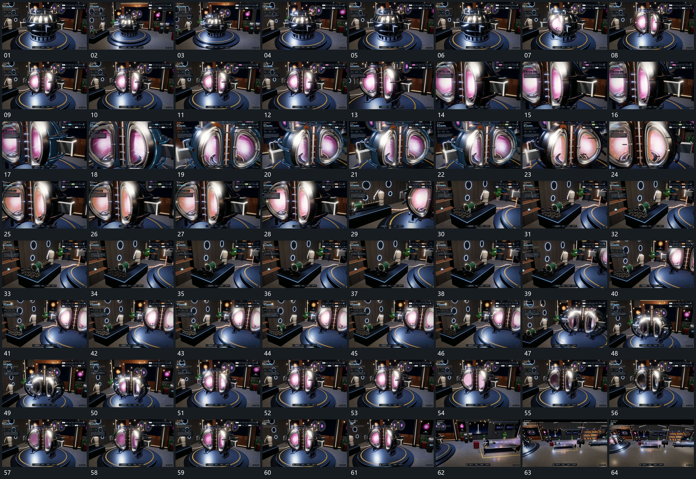

# 101 · 运动过程总览

## 运动总览

全片先用[围中央组转角靠近再退到共同全貌](mechanisms/m01.md)围中央组转角并小幅推退。[曲面外层向两侧拉开露出内层再合拢](mechanisms/m02.md)把曲面外层从中央两侧拉开，使内层显露；取景在打开过程中靠近。内部运动使用[内部细线围共同局部弯曲绕行并逐次接续](mechanisms/m03.md)，弯曲细线与点围共同局部持续经过。

取景转向旁侧小组时，[沿共同连接让短段依次经过原结构保持](mechanisms/m04.md)沿可见连接让短段依次经过，原中央组仍在边缘。之后[围中央组转角靠近再退到共同全貌](mechanisms/m01.md)退回全貌，[曲面外层向两侧拉开露出内层再合拢](mechanisms/m02.md)反向合拢再重新打开，末段退到更宽范围，完整空间保持。

## 完整64宫格

按从左至右、从上至下阅读，覆盖全片首尾。具体运动分镜见各子机制。

## 原片与观察范围

[观看参考视频](video.mp4) · [原始来源](https://skillry.dev/ai-videos/opus-5-5/konstantinsaifo-587629)

依据真实源帧总览及必要局部序列整理，仅描述可见运动、相对布局与接续。抽帧观察不等于原速连续观看或声音核验；不推定精确曲线、隐藏结构、作者源码或原始生成指令。迁移到新片仍需实现和预览。
