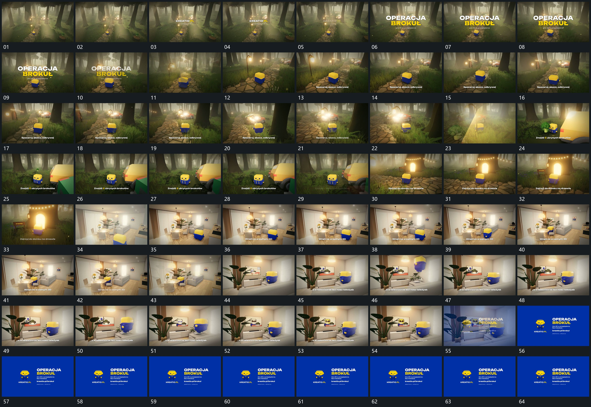

# 089 · 运动过程总览

## 运动总览

全片以[沿弯曲路径跟随主形并逐步靠近转角](mechanisms/m01.md)沿弯曲路径跟随同一主形，取景逐步靠近并转角。路径旁的小局部用[旁侧小形升起缩小退去主形保持](mechanisms/m02.md)升起、缩小并退去。靠近亮开口后清楚换到另一空间，仍保留原主形；新空间继续复用[沿弯曲路径跟随主形并逐步靠近转角](mechanisms/m01.md)改变位置与观察角度。

局部近景多次复用[主形从承载面抬起带转角再落回](mechanisms/m03.md)，主形抬起、转角并落回同一承载面。最后[空间退弱结尾组建立后空底接管并缩定](mechanisms/m04.md)减弱空间并建立结尾组，底层被空底接管后，主形与字行一起缩到稳定范围。

## 完整64宫格

按从左至右、从上至下阅读，覆盖全片首尾。具体运动分镜见各子机制。

## 原片与观察范围

[观看参考视频](video.mp4) · [原始来源](https://skillry.dev/ai-videos/opus-5-5/ksmialowski-473410)

依据真实源帧总览及必要局部序列整理，仅描述可见运动、相对布局与接续。抽帧观察不等于原速连续观看或声音核验；不推定精确曲线、隐藏结构、作者源码或原始生成指令。迁移到新片仍需实现和预览。
