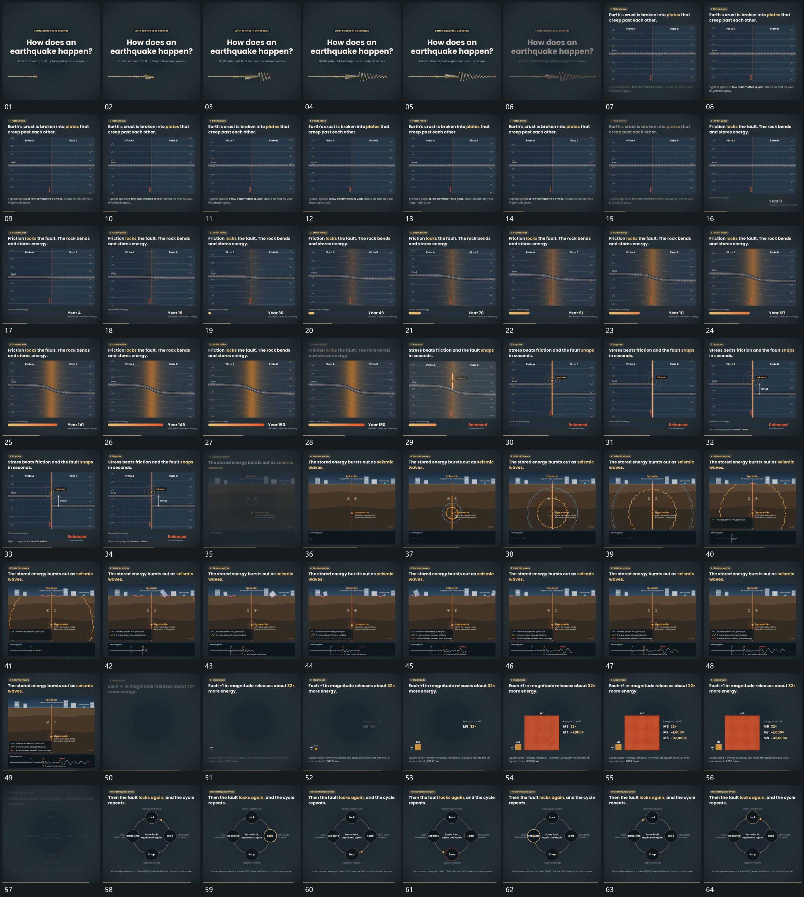

# 055 · 运动过程总览

## 运动总览

开头 [波形从左向右延长，振幅增大后逐步收回](mechanisms/m01.md) 将一条短波形从左向右延长，振幅先增大后收回。[分界两侧线组反向错动，中部连线逐渐弯曲](mechanisms/m02.md) 保留中央分界，让两侧线组沿相反方向缓慢错动；之后中部横线逐渐弯曲，下条延长，数值增加。

中段 [弯曲组短促释放成错段，中心圈扩散后补差距边界](mechanisms/m03.md) 将弯曲组释放成错开的两段，中心小圈扩散，短边界补出两段差距。[中心多层圆波向外扩散，经过后外围块摆动，下方波形接续](mechanisms/m04.md) 在新固定空间从中心扩出多层圆波，外围块在波经过后轻微摆动，下方小波形接续增长。[小方块先建立，后续更大方块依次接入](mechanisms/m05.md) 从小方块逐次建立更大方块，已有块保持。末段 [点沿圆形路径依次经过节点，到站节点突出后继续绕行](mechanisms/m06.md) 用点沿圆形路径依次经过多个节点，每到一处该节点突出，继续下一处并循环保持。

## 完整64宫格

按从左至右、从上至下阅读，覆盖全片首尾。具体运动分镜见各子机制。

## 原片与观察范围

[观看参考视频](video.mp4) · [原始来源](https://skillry.dev/ai-videos/opus-5-5/kureshirfan-386691)

依据真实源帧总览及必要局部序列整理，仅描述可见运动、相对布局与接续。抽帧观察不等于原速连续观看或声音核验；不推定精确曲线、隐藏结构、作者源码或原始生成指令。迁移到新片仍需实现和预览。
