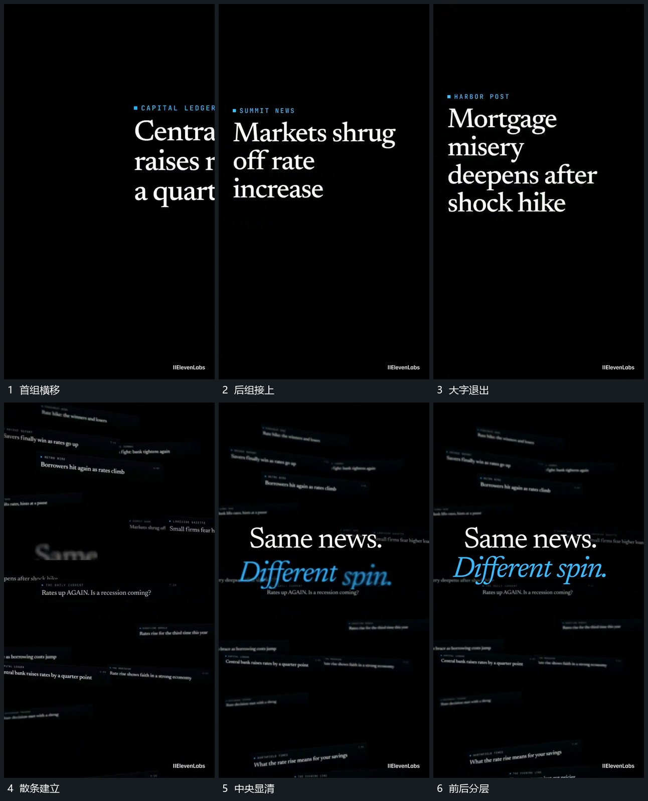

# 大字横向轮换，退去后散条与中央文字分层建立

## 运动指令

让大字一组接一组横向滑过，前组退出后下一组接上。最后一组退去，画面转成多条倾斜小片缓慢移动的后层；中央两行文字由模糊变清楚，后层运动继续。源帧能确认状态接续，不能确认每个大字是否逐一变成某条小片。

## 分镜过程

## 组合与调整

可改轮换组数与横向方向，中央文字出现后让它稳定。组合时从散条后层继续选中某一条，不能声称每条都继承了片头字形。
