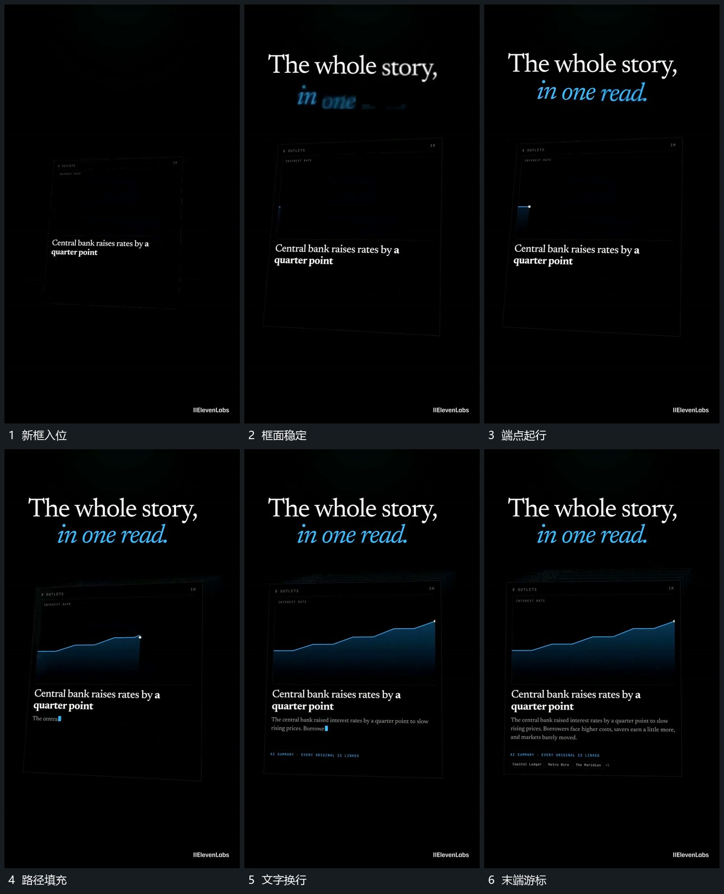

# 折线端点向右推进，填充与下方文字接续增长

## 运动指令

先让矩形区域带轻微倾角进入并稳定，然后将折线端点向右推进，已走过的路径留下，下方填充随路径展开。图形逐步成形时，下方文字从左向右连续增加并换行，末端游标随输入向前移动，底部小标签随后追加。

## 分镜过程

## 组合与调整

图形和文字可分开采用，若同时使用要保留上下分区。曲线含义另行确定；本机制不从可见折线推断真实数据或算法。
