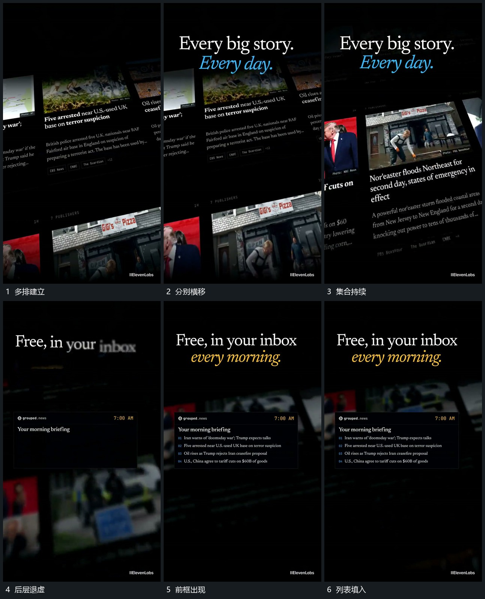

# 多排图块横向流动，前景小框接管而底层继续

## 运动指令

让多排图块各自横向流动，整体带倾斜关系，上下排不必同步同向。保持这种流动，将后层逐渐模糊；前方接入独立小框，下面的列表按行填入，上方标题保持清楚。后层继续移动，前景内容落稳后不跟着平移。

## 分镜过程

## 组合与调整

可以换图块内容，迁移的是层间运动关系，原片内的图片不自动成为可用素材。前景建立后降低后层运动幅度，后续可从小框继续放大。
