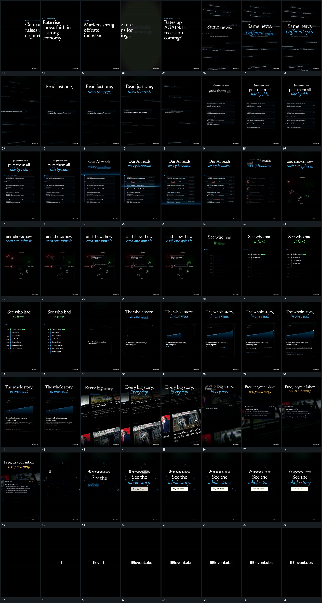

# 051 · 运动过程总览

## 运动总览

开头 [大字横向轮换，退去后散条与中央文字分层建立](mechanisms/m01.md) 让大字横向轮换，转入后层散条和中央清楚字组。[从流动散条中突出一条，其余退淡](mechanisms/m02.md) 从散条集合中突出一条，随后 [倾斜散条转正归队，再沿侧边连成纵列](mechanisms/m03.md) 将散条转正归队，排成纵列并补入侧线连接。

纵列建立后，[亮带逐行下扫，经过处保留新增标记](mechanisms/m04.md) 逐行扫描并留下结果。接 [行端圆点脱离旧列表，散开后落到新坐标](mechanisms/m05.md) 留下行端圆点，退去旧框与文字，让节点散开、落到新线框里；[节点外圈扩散，旁侧浮卡按点接力出现](mechanisms/m06.md) 逐个提示节点并展开浮卡。之后这组退出，[亮点沿纵线下行，各行依次显清并更新计数](mechanisms/m07.md) 用新的竖向路径依次激活行文和计数。

下一矩形倾斜入位，[折线端点向右推进，填充与下方文字接续增长](mechanisms/m08.md) 在内部增长折线、填充及下方文字。再切到 [多排图块横向流动，前景小框接管而底层继续](mechanisms/m09.md) 的多排图块流动，后层退虚但继续运动，前方小框与列表接管观看重点。

后段 [中心组由上至下逐层建立，最后保持整体](mechanisms/m10.md) 将上标、主副行与长条逐层建立，保持后退成空底。尾部 [竖线先立，字符向右展开形成短行](mechanisms/m11.md) 先立竖线再向右展开短行，完成整片收势。这里仅记录图块与文字的运动，不由原片题材推断外部视频素材。

## 完整64宫格

按从左至右、从上至下阅读，覆盖开头到结尾；用于查看全片发展，具体机制已在各自文档中配分镜。

## 原片与观察范围

[观看参考视频](video.mp4) · [原始来源](https://skillry.dev/ai-videos/opus-5-5/l3d1c-632524)

本次依据真实源帧的完整总览、密集序列及必要局部补帧整理，仅记录可见运动与接续。抽帧观察不等于原速连续观看或声音核验；不据此指定精确曲线、隐藏结构、作者源码或原始生成指令。机制可迁移，具体实现仍需在新片中预览检验。
