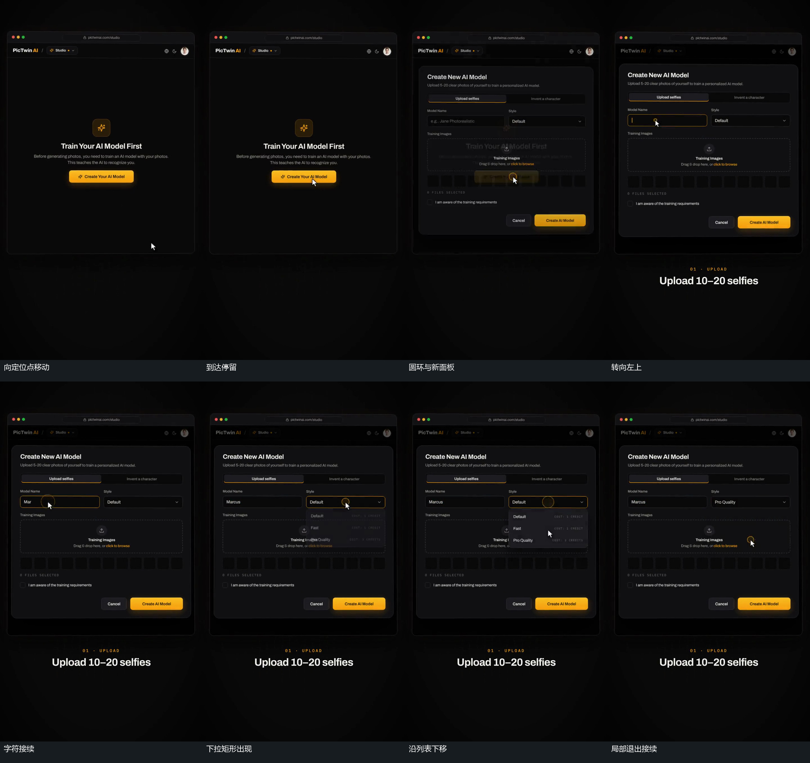

# 指示符走位，圆环与局部面板依次承接

## 运动指令

让大窗口外轮廓保持，令指示符从动作点之外沿路径移动到中央短条并短暂停留。让定位处圆环出现，同时使新局部面板从淡到清楚叠入，旧中心内容短暂留在后面再减淡。当新面板可定位时，让指示符向左上小框移动；到达后出现圆环及边框变化，框内字符逐次增加。随后让指示符转向另一小框，圆环先接入，下拉矩形再展开。让指示符沿列表向下走，局部字符更换后令列表退出，指示符继续移向下一个预定区域。外框在整条接力中保留。

## 分镜过程

## 组合与调整

可调整定位点、路径、短暂停留、局部面板数量以及字符增加的范围。字符增加也可改为单一长条内从同一起点向右接续；箭头不必逐字跟随。下一机制应在定位区域已经建立时进入，例如接图块填槽或短形状变化。

