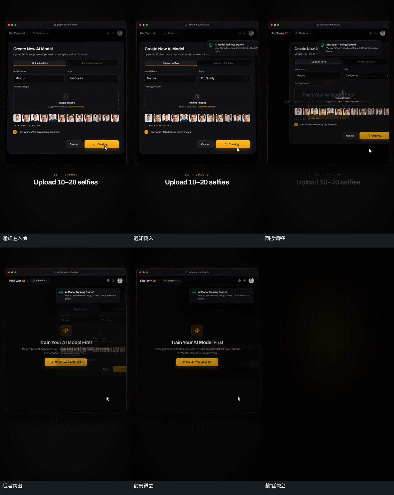

# 通知从侧边滑入，前景面板偏移退去露出底层

## 运动指令

让前景面板先保持，令右上小通知矩形从右边界向左滑入并变清楚。当通知还在进入时，让前景面板向右偏移并减淡，先露出它后面的旧中心内容。让通知继续留在上方，前景退出后底层短暂保留；随后清掉剩余旧组，为下一中心卡腾出位置。不要让所有层同时消失，否则会丢掉前景退去后露底的接续。

## 分镜过程

## 组合与调整

可调整通知来路、停留位置、面板离开方向及底层短暂保留长度。若下一组提前接入，要明确保留与新组的层间关系；原片的底层露出不能自动视为面板变形成新卡。

