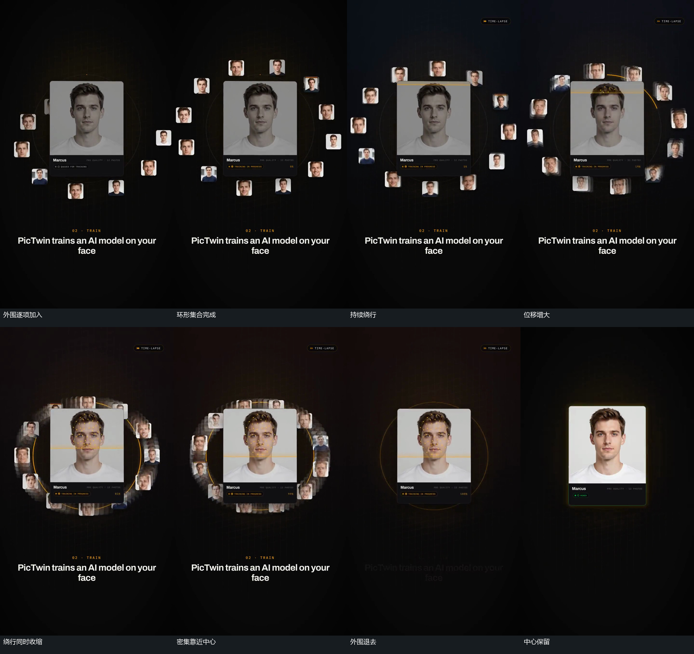

# 中心卡保持，外围绕行加快并缩小半径

## 运动指令

让中心卡的方向与尺度保持，令外围小图块从不同方位逐项加入，补成环形集合。形成集合后，让外围块沿顺时针方向绕中心走位；初始每次位移较小，随后让相同过程内经过的距离逐渐增大。让绕行保持连续，同时缩小外围路径半径，使小块越来越靠近中心、间距更紧。中心卡不随之缩小或旋转。最后让外围块退去，外环线可短暂保留再退出，中心卡继续留住并接下一动作。

## 分镜过程

## 组合与调整

可调整环形路径、图块数量、绕行方向、收缩范围和末尾退出方式。加快以可见位移增大来约束，不声称原片用了哪一种曲线；如同时使用内部扫描，让扫描和外围收拢分别推进，不互相等待。

