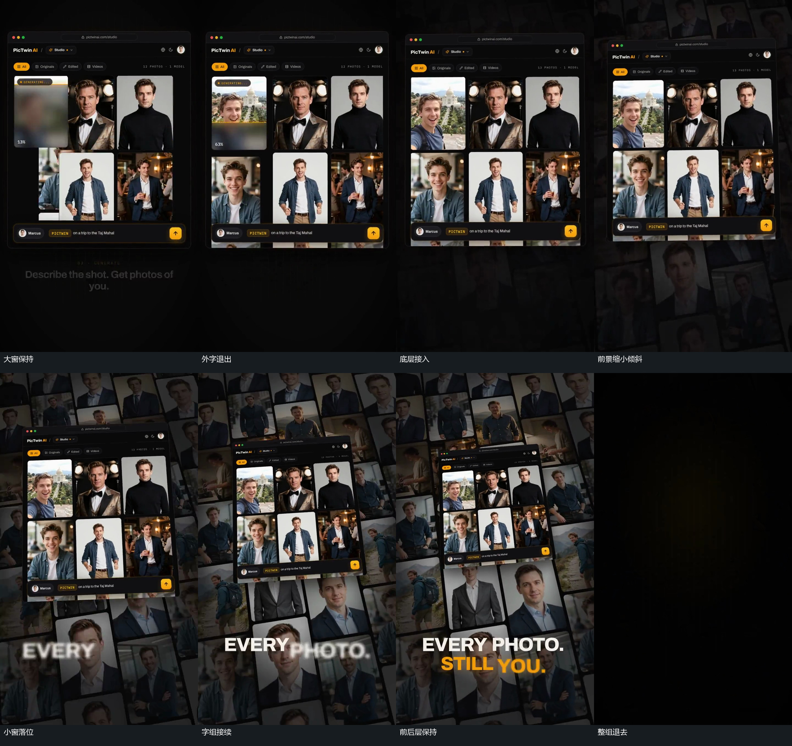

# 窗口缩小并倾斜，底层满幅集合接入

## 运动指令

让前景窗口保留内部图块与底边长条，先让窗口外的字组减淡。当最后一个内部图块仍在完成变化时，让底层多排图块集合逐渐接入，并延伸到画面四周之外。与此同时，让前景窗口缩小并倾斜，使右上角高于左上角，连续保留可追踪的外边界，最后落到画面中上部。随后让下方字组逐词接入，前景继续小幅调整，底层集合缓慢位移。需要离开时，让整组向左偏移并减淡，为独立下一窗口腾出底图。

## 分镜过程

## 组合与调整

可调整前景最终尺度、倾斜角度、停留位置以及底层接入与缩小之间的交叠。保留前景内部内容，不能在缩小途中换成其他窗口。全组退出是独立步骤，可省略并直接保持；这些对象变化不必被称作真实镜头后退。

