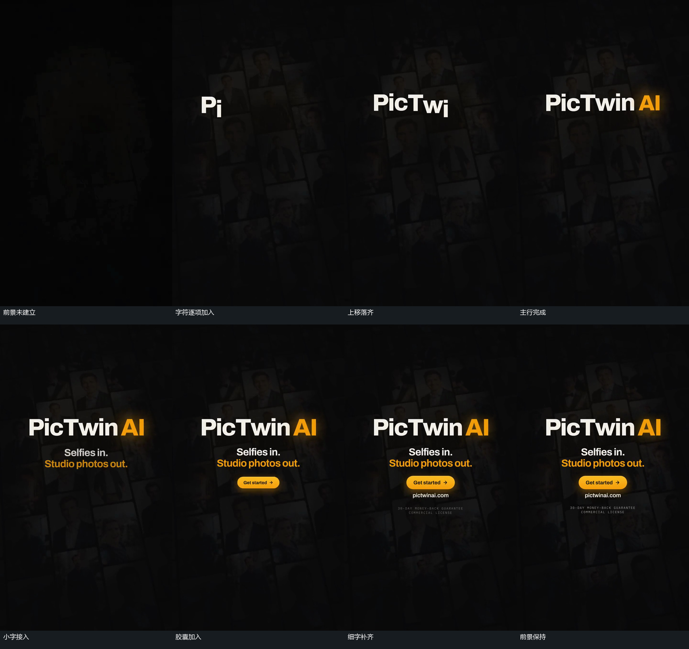

# 字符逐项上移落到同一行，下方小组错开补齐

## 运动指令

让底层倾斜图块集合保持缓慢位移，令主行字符从左到右逐项加入。让新字符初入时略偏下，随后向上落到同一行，已落齐的字符留在原位置。主行完成后，让下方两行小字从淡到清楚并略上移，再让更下方胶囊从小尺寸扩大，轻微回调到稳定大小。随后依次补入一行小字和两行细字，让前面的组保持，不被新组推动。最终让全部前景稳定，底层图块集合继续缓慢向上经过其后方，直到结束。

## 分镜过程

## 组合与调整

可调整字符数量、初始偏移、字符间错开量，以及小字与胶囊各组的加入顺序。保持段可以伸缩，但前景不随底层上移。若需要片尾退场，应另行设计；原片到结束仍保留这组前景。

