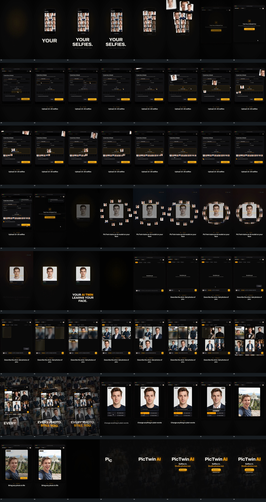

# 007｜原片运动总览

[观看完整原片](video.mp4)

开场先让竖框出现并扩大落稳，下方两行大字与更小一行错开显出并略上移，接[竖框与文字建立](mechanisms/m01.md)。竖框内的小角标按行从左到右逐项加入，已出现的角标保持，接[角标累积](mechanisms/m02.md)。随后部分图块减淡，另一些逐个清楚并扩大、拉开间距；下方字组减淡，上排图块先向外放大，中下排随后接入同样动作，前后排交叠越过框与画面边界，接[分排放大退出](mechanisms/m03.md)。旧组退去后，独立新窗口从底图接入。

新窗口建立后，指示符从右下走到中央短条，定位处圆环出现，新面板叠入而旧文字暂留后减淡。指示符再转向左上小框，圆环和边框变化接入，字符逐字增加；随后到右侧小框，下拉矩形展开，指示符沿列表下移，局部内容更换后列表退出。这段按[指示符、圆环与局部内容接力](mechanisms/m04.md)持续进行，外部窗口保留。

指示符到中部承载区域后，图块从上方不同位置进入。它们一边下降一边缩小、转正，横向靠近各自小槽，从左到右累积。已有块落槽、较新块在中部下降、最新块从上方露出同时发生，接[交叠下落缩小填槽](mechanisms/m05.md)。最后一块落稳后整排留住，指示符接着向左下小方框移动，圆环与勾形出现，再向右下短条移动；短条内部字符更换，小弧圈持续改变角度，仍沿用[定位与局部形状接力](mechanisms/m04.md)。

右上通知矩形从侧边滑入时，前景面板已经向右偏移并减淡，先露出后面的旧内容，再清掉剩余组，接[通知侧入与分层退出](mechanisms/m06.md)。随后中心卡建立，外围小图块从不同方位逐项补成环。中心卡保持方向与尺度，外围开始顺时针绕行，相同过程内位移逐渐增加，同时半径缩小、间距变紧，接[外围绕行与收缩](mechanisms/m07.md)。

外围仍在绕行时，中心卡上方横线向下移动，内部点与连接线逐渐增加；卡外环形线从上部接向右侧、下部和左侧。内部变化可以按[扫描推进](mechanisms/m08.md)的点线版本接续，与外围运动并行。卡下小字符离散更换，后面停止变化；外部字组先减淡，外围图块退出，环线和内部点线短暂保留再退去，中心卡继续保留并变清楚，外围亮区向外扩散。

中心卡小幅调整，下方多行大字按词组由模糊到清楚，前词留在原位置，后词接续，接[固定字组逐词建立](mechanisms/m09.md)。旧卡与旧字组随后迅速退去，短暂露出底图，独立新窗口从暗到清楚接入。

新窗口保留上方小胶囊、中央短字和底边输入长条。指示符从长条下方走向左上，圆环与竖短线接入，字符从同一起点向右逐项增加；指示符抬离长条，右上短矩形片出现并落稳，可复用[指示符与局部内容接力](mechanisms/m04.md)。字符完成后窗口上部先接入四张竖图块，中央短字让位而外框和输入长条保留。

四张图块内部由模糊到清楚：横线从各块上沿向下推进，横线上方逐步清楚，下方仍模糊。后块错开启动，早块接近完成时后块继续变化，各块上沿小标记随完成退出，接[多个图块扫描揭示](mechanisms/m08.md)。初组完成后短暂停留，输入条内字符更换，新块从左上叠入，旧块向右、向下让位，移动时暂时叠压，落稳后恢复网格。新块内部扫描在旧组尚未全部排稳时就启动；后续新块继续从左上进入，更早图块从窗口底边裁去，接[新块插入与网格让位累积](mechanisms/m10.md)。内部扫描过程逐次变短，与位置让位共同接力。

最后一块仍在揭示时，窗口外字组减淡，底层多排图块集合接入并扩展到四周之外。前景窗口保留内部内容，缩小并倾斜，最终叠在画面中上部；下方字组再逐词接入，底层慢移，接[窗口缩小倾斜与底层集合](mechanisms/m11.md)。完成后整组向左偏移并减淡，腾出底图给下一窗口。

新窗口接入后，中央竖图块占主要区域，下方两行短条保留，指示符走向左侧短条，状态形状变化；图块底部长条叠入并逐字填入内容，可复用[局部接力](mechanisms/m04.md)。随后竖线与小圆柄从图块左边出现并向右走，指示符同行，线左侧显示新内容、右侧保留旧内容，接近右边缘时位移减小，最后线与圆柄退出，接[横移分界线替换内部内容](mechanisms/m12.md)。外部字组减淡后，中央旧图像直接换成更宽的独立图块，外窗口保留并小幅调整，下方新字组建立。

指示符向图块右下移动，底边短条与小形状进入，上方小胶囊出现，底边短线从左向右扩张。短线接近右端后与右下短条一起退出，中央三角形暂留再退去，内部裁切内容开始小幅变化，底边细线重新增长，接[底边长度变化与内部微动接力](mechanisms/m13.md)。外框保持，随后整组减淡，底层倾斜集合重新接入。

片尾主行字符从左到右逐项加入，新字符略偏下再上移落到同一行，完成后下方小字、胶囊及更小文字依次建立，接[字符与下方小组接力](mechanisms/m14.md)。前景落稳后一直保持，后方倾斜图块集合缓慢向上移动，原片到结束也没有让这组退场。

这些卡片把已经观察到的动作关系转成可调整的运动指令；具体曲线与原始实现未知，使用时以起始状态、交叠、减速、落稳、保持和接续条件为约束。

