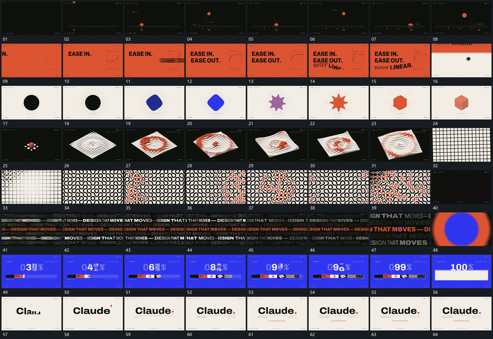

# 112 · 运动过程总览

## 运动总览

全片由[球下降压扁伸展后沿前方继续起落](mechanisms/m01.md)让球下降、压扁、伸展并再次起落，接到[字片横向移入分行累积后末行带转角接上](mechanisms/m02.md)的分行字片移入。随后[中央轮廓转角变形外围轮廓延迟跟上](mechanisms/m03.md)让中央轮廓转角变形，外围细轮廓稍后跟上。

空间阵列段[少量格块展开整面高度波从中心向外经过](mechanisms/m04.md)从中央少量格块展开整面，再让高度波动向外经过；[格位内曲线片逐项描入局部转角沿面传递](mechanisms/m05.md)在格位内逐步描出曲线片段，并让局部转角形成面内经过。后段[多排长字错开横向经过再逐步靠近](mechanisms/m06.md)让多排长字错开经过再放大接近，[圆区覆盖后长条逐段累积窗口内竖向接替](mechanisms/m07.md)通过圆区覆盖进入长条累积与窗口内接替。结尾[主行逐段显露小点落到末端下线再展开](mechanisms/m08.md)建立主行、行末点和附属行，原底保持。

## 完整64宫格

按从左至右、从上至下阅读，覆盖全片首尾。具体运动分镜见各子机制。

## 原片与观察范围

[观看参考视频](video.mp4) · [原始来源](https://skillry.dev/ai-videos/opus-5-5/levabashidze-184909)

依据真实源帧总览及必要局部序列整理，仅描述可见运动、相对布局与接续。抽帧观察不等于原速连续观看或声音核验；不推定精确曲线、隐藏结构、作者源码或原始生成指令。迁移到新片仍需实现和预览。
