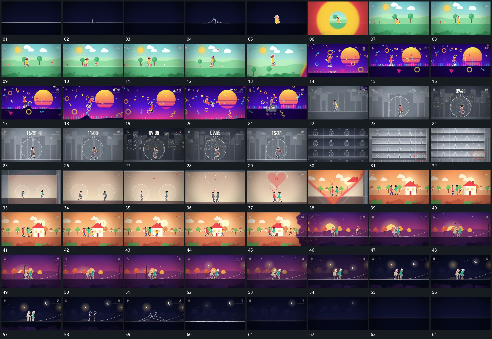

# 074 · 运动过程总览

## 运动总览

全片以[平线局部起伏后建立线上小形](mechanisms/m01.md)从平直细线发展出局部波和小形，[围主形的圆边界扩张覆盖并换底](mechanisms/m02.md)围绕小形扩张覆盖，打开沿底线连续经过的空间。[主形沿底线经过后层分层视差接替](mechanisms/m03.md)保持主形与轨迹连续，后层按不同幅度经过；经过坡面时接入[沿坡升起翻转后落回底线继续](mechanisms/m04.md)的升起、翻转和落稳。

中段以圆边界包住主形，外围短条在原位接替；再用[单区退为多排集合再推向局部选项](mechanisms/m05.md)退为多排集合并推向一个选项。选项中的双圆通过[两个圆区靠近接成新轮廓再扩张](mechanisms/m06.md)靠近、相接、形成新轮廓，其扩张复用[围主形的圆边界扩张覆盖并换底](mechanisms/m02.md)接管后层。两组形继续复用[主形沿底线经过后层分层视差接替](mechanisms/m03.md)，轨迹上扬而旁形分次接入。末段用[组形减为细轮廓再拉伸回平线](mechanisms/m07.md)把组形减为轮廓，再拉伸回细线与短波，最终回到平直起点。

## 完整64宫格

按从左至右、从上至下阅读，覆盖全片首尾。具体运动分镜见各子机制。

## 原片与观察范围

[观看参考视频](video.mp4) · [原始来源](https://skillry.dev/ai-videos/opus-5-5/loicrambo-980558)

依据真实源帧总览及必要局部序列整理，仅描述可见运动、相对布局与接续。抽帧观察不等于原速连续观看或声音核验；不推定精确曲线、隐藏结构、作者源码或原始生成指令。迁移到新片仍需实现和预览。
