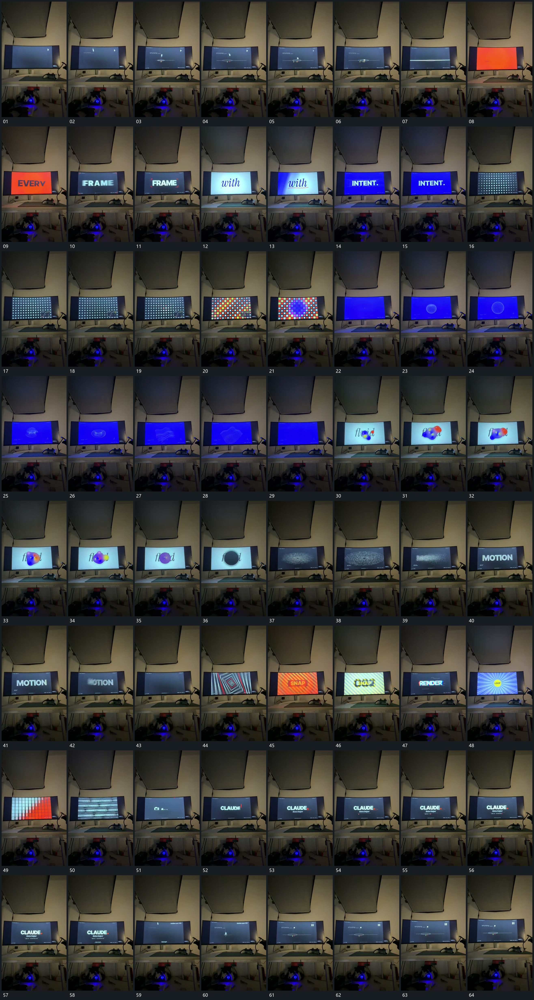

# 023 · 运动过程总览

## 运动总览

原片是拍摄画面内的动画，以下只提取其中的运动，不把外部拍摄环境写成机制。开头细小形落到横线附近，亮线短闪后进入 [中央词组快速接替，局部线形随后强调](mechanisms/m01.md) 的中央词组轮换。

随后 [网格小格逐项变化，中央区域获得重点](mechanisms/m02.md) 在规则网格中逐项改变小格状态，中心区域逐渐突出。换入圆形线组后，[圆形线组压扁拉伸并扭转，中心位置保持](mechanisms/m03.md) 连续扭动、压扁和拉伸，同时保留中央范围。接 [圆团分离又重叠，收成暗圆后点群扩散](mechanisms/m04.md) 让圆团分合、互相覆盖，再退成暗圆；点群散开后重新聚合成大字。

后段多个全幅短组快速接替，[嵌套矩形向中心推进，网格斜向接替后横条经过](mechanisms/m05.md) 让矩形轮廓嵌套推进，随后多格斜向变换接入横向条组。片尾大字建立，回到小形与横线，构图近似开头，不认定精确无缝循环。

## 完整64宫格

按从左至右、从上至下阅读，覆盖全片首尾。具体运动分镜见各子机制。

## 原片与观察范围

[观看参考视频](video.mp4) · [原始来源](https://skillry.dev/ai-videos/opus-5-5/m1n9-k7-466682)

依据真实源帧总览及必要局部序列整理，仅描述可见运动、相对布局与接续。抽帧观察不等于原速连续观看或声音核验；不推定精确曲线、隐藏结构、作者源码或原始生成指令。迁移到新片仍需实现和预览。
