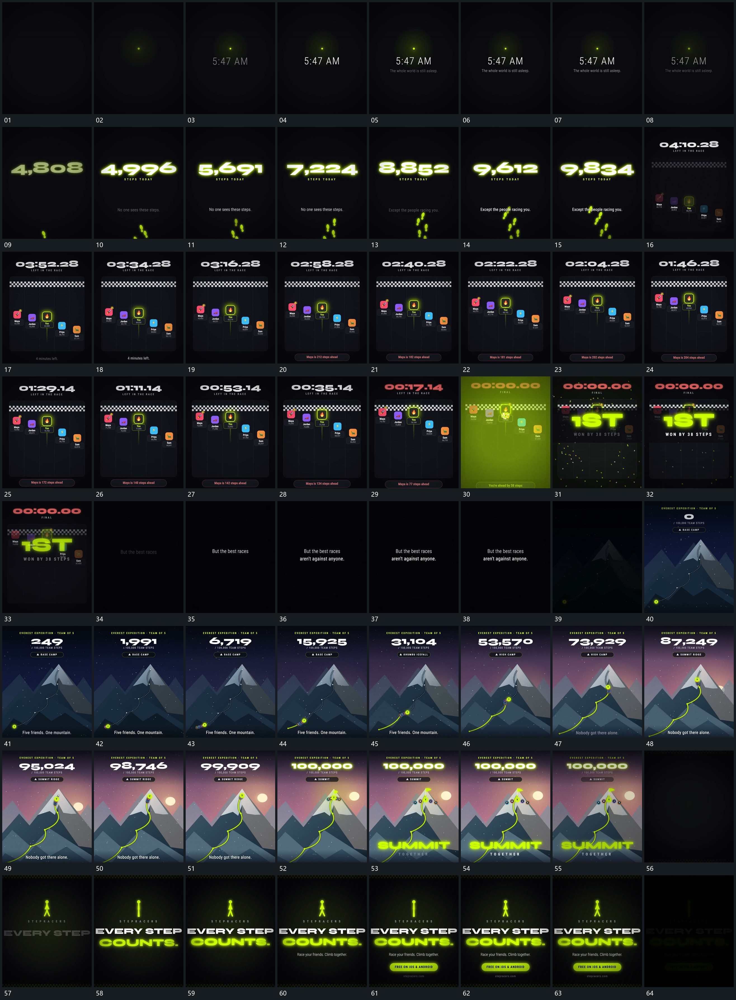

# 067 · 运动过程总览

## 运动总览

开头点与短字建立，字组退去后 [中央数值增长，成对小形错开上移并越过边缘](mechanisms/m01.md) 中央大数值持续增长，下方成对小形错开上移并越界。[多个小片沿独立竖轨上移，位置超越时保持来源轨迹](mechanisms/m02.md) 固定大框中多个小片沿各自竖向轨迹上移，数值增加，上方另一数值递减，位置关系发生超越。

终点 [局部圈形接入，底层退弱，大字缩回前景，散片短促退出](mechanisms/m03.md) 局部圈形反馈接入，底层退弱，大字由大缩回到前景，短散片经过后退出。字组接替后 [小片群沿虚线前进，实线在经过处延长，数值增长](mechanisms/m04.md) 在固定空间沿虚线轨迹推进小片群，已经过路径延长实线，顶部数值增加。[到站后末端标记建立，片群展开到两侧，下字接上](mechanisms/m05.md) 路径到终点时末端标记建立，片群展开到其两侧，下方大字随后接入。结尾主形、分行字组与底条逐项建立，整体退暗。

## 完整64宫格

按从左至右、从上至下阅读，覆盖全片首尾。具体运动分镜见各子机制。

## 原片与观察范围

[观看参考视频](video.mp4) · [原始来源](https://skillry.dev/ai-videos/opus-5-5/marklaunches-041046)

依据真实源帧总览及必要局部序列整理，仅描述可见运动、相对布局与接续。抽帧观察不等于原速连续观看或声音核验；不推定精确曲线、隐藏结构、作者源码或原始生成指令。迁移到新片仍需实现和预览。
