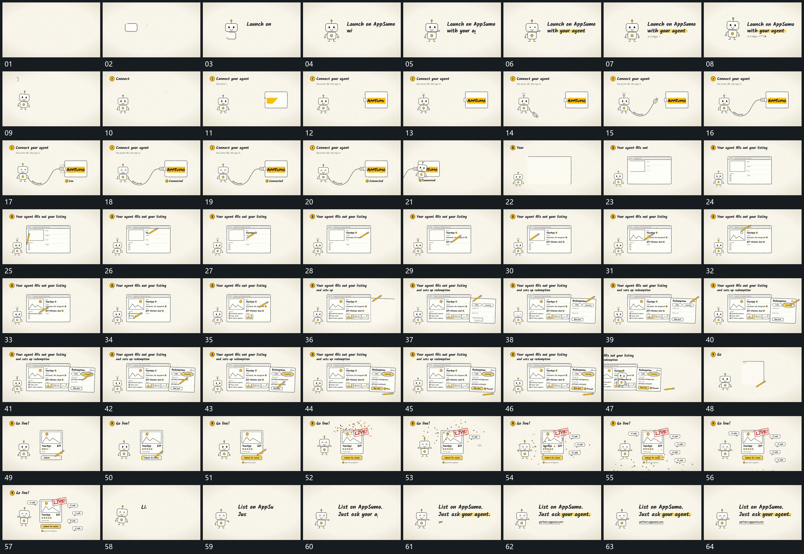

# 077 · 运动过程总览

## 运动总览

全片以[小轮廓逐段描出短行逐字补齐再划线](mechanisms/m01.md)建立小轮廓和逐字短行，再换到左右两组，由[曲线端头从左组延伸并对准右框接合](mechanisms/m02.md)延伸曲线接上右框。之后[指示长片沿局部经过并留下逐项填充](mechanisms/m03.md)沿多个局部连续填入，已填项保持；[主框保持旁侧片面再被描出并补内部](mechanisms/m04.md)在主框旁再描出第二片面，并继续复用[指示长片沿局部经过并留下逐项填充](mechanisms/m03.md)。

阶段切换时[完成组侧移保留小形后重新建立空框](mechanisms/m05.md)将完成组移出，保留小形并给下一框重新留空。末段竖框完成后以[斜标接入后散点外放小气泡逐次累积](mechanisms/m06.md)加入斜标、向外散点和逐项小气泡。最后回到小形与短行，复用[小轮廓逐段描出短行逐字补齐再划线](mechanisms/m01.md)的分项建立与下划线收束。

## 完整64宫格

按从左至右、从上至下阅读，覆盖全片首尾。具体运动分镜见各子机制。

## 原片与观察范围

[观看参考视频](video.mp4) · [原始来源](https://skillry.dev/ai-videos/opus-5-5/mattbean-917572)

依据真实源帧总览及必要局部序列整理，仅描述可见运动、相对布局与接续。抽帧观察不等于原速连续观看或声音核验；不推定精确曲线、隐藏结构、作者源码或原始生成指令。迁移到新片仍需实现和预览。
