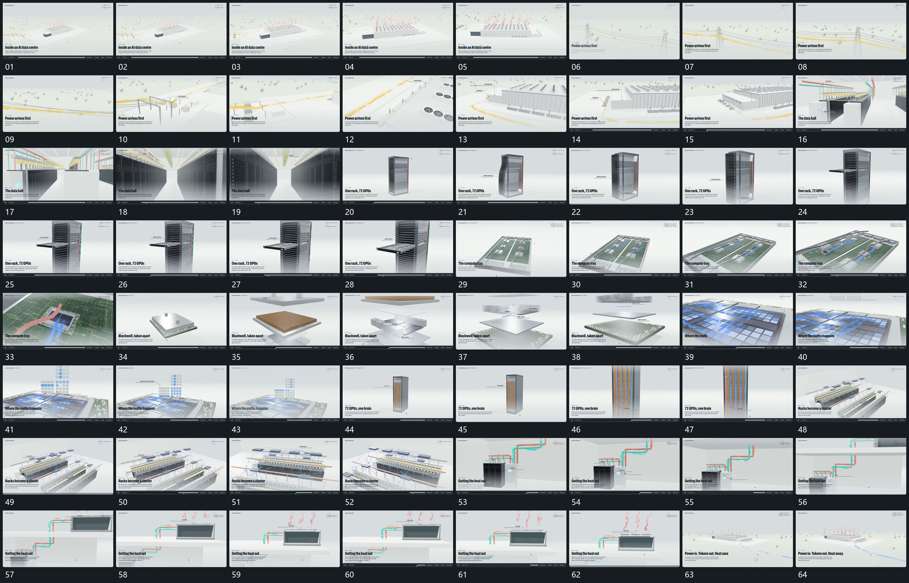

# 094 · 运动过程总览

## 运动总览

全片以[围共同结构转角推近沿通道经过再退回](mechanisms/m01.md)围同一结构转角、靠近、沿通道经过再退回全貌。多段重复[短带与箭头沿已有连接持续经过](mechanisms/m02.md)，让短带、点与箭头沿已建立线路流动，底层连接保持。

进入竖向层架后，[竖向层架中一片沿水平方向拉出并保持](mechanisms/m03.md)从中间层水平拉出薄片，取景再沿薄片推近。内部段落用[多层沿同一纵向分离再向下层转移取景](mechanisms/m04.md)沿同一纵向分离多层，露出间隙后把取景降到下层；[面板上方格阵建立标记沿列逐项填入](mechanisms/m05.md)在固定面板上方建立格阵，并按列逐项填入标记。后段[沿竖向长组靠近局部再抬到上端](mechanisms/m06.md)沿竖向长组推进到局部、再转向上端，最后[围共同结构转角推近沿通道经过再退回](mechanisms/m01.md)退到全貌，[上端短带持续向外围经过并逐步退弱](mechanisms/m07.md)让向外短带持续经过并释放到外围。

## 完整64宫格

按从左至右、从上至下阅读，覆盖全片首尾。具体运动分镜见各子机制。

## 原片与观察范围

[观看参考视频](video.mp4) · [原始来源](https://skillry.dev/ai-videos/opus-5-5/mdaman010-111079)

依据真实源帧总览及必要局部序列整理，仅描述可见运动、相对布局与接续。抽帧观察不等于原速连续观看或声音核验；不推定精确曲线、隐藏结构、作者源码或原始生成指令。迁移到新片仍需实现和预览。
