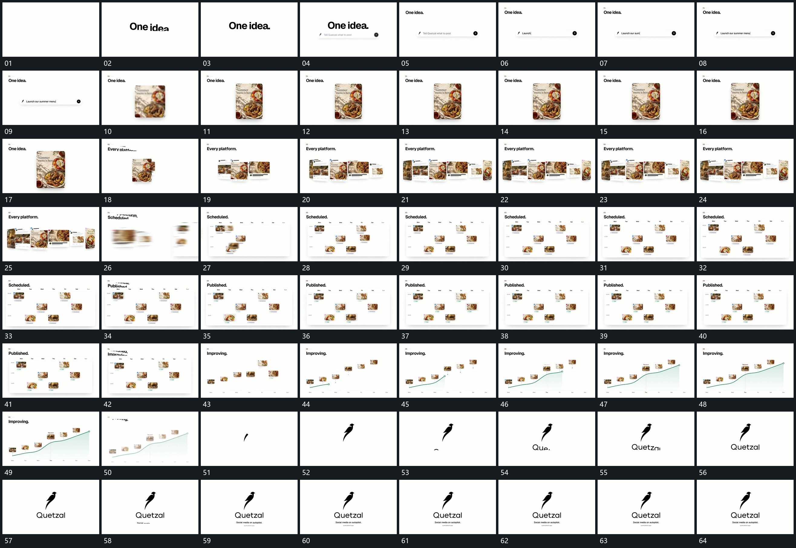

# 024 · 运动过程总览

## 运动总览

开头大字建立后上移缩小，[主字上移缩小，输入条逐字补齐后交给竖片](mechanisms/m01.md) 在下方输入条逐字补齐，再将内容接给独立竖片。随后 [保留中心片，左右错开补入后片](mechanisms/m02.md) 保留这张片作为中心，左右补入不同大小的片面，组成一排。

中段 [横排收小并分配到网格空位，局部状态逐项更新](mechanisms/m03.md) 把横排收小并分配到固定网格的不同空位，格内状态逐项更新。后段 [网格退出，图块重排到递增位置，曲线随之长出](mechanisms/m04.md) 退去网格边界，图块重排到递增位置，折线和填充从左到右生长，已放好的图块保持。末尾图表退去，标记与名称逐段建立。

## 完整64宫格

按从左至右、从上至下阅读，覆盖全片首尾。具体运动分镜见各子机制。

## 原片与观察范围

[观看参考视频](video.mp4) · [原始来源](https://skillry.dev/ai-videos/opus-5-5/miskinho-956105)

依据真实源帧总览及必要局部序列整理，仅描述可见运动、相对布局与接续。抽帧观察不等于原速连续观看或声音核验；不推定精确曲线、隐藏结构、作者源码或原始生成指令。迁移到新片仍需实现和预览。
