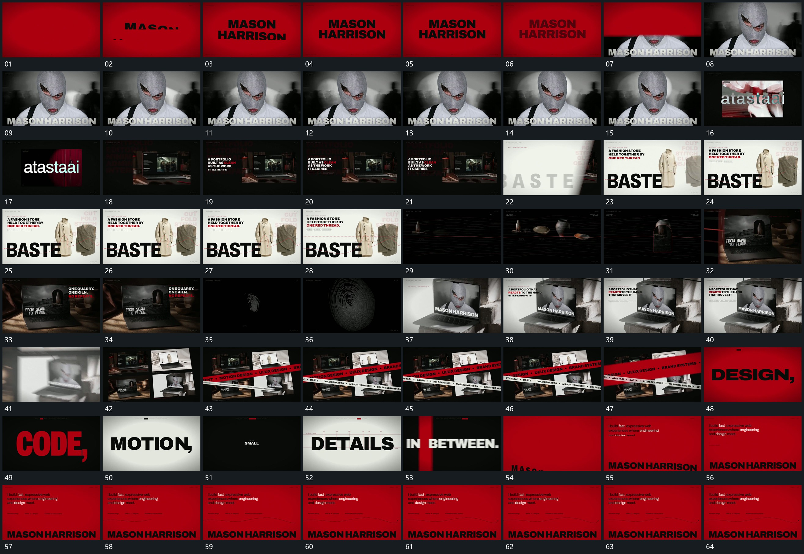

# 016 · 运动过程总览

## 运动总览

片头 [大字从遮挡边界升出，新图自下方揭示](mechanisms/m01.md) 让大字越过遮挡边界建立，新图从下方揭出，字组留在底部。接 [满幅退为小框，内部换图后旁字补齐](mechanisms/m02.md) 将图像缩为框内内容，切换内部画面后补旁侧字。随后 [翻卷状覆盖从侧边通过，揭出下一布局](mechanisms/m03.md) 从侧面推进翻卷状覆盖层，换入新的并置布局。

中段 [细线在对象前后逐段延长，曲线持续波动](mechanisms/m04.md) 在稳定对象前后延长细线与曲线，再换到活动框，旁字仍按分行接力。下一组由同类覆盖换场接入。后段 [多片缩排成集合，交叉长带从两侧经过](mechanisms/m05.md) 让多片缩排成集合，交叉长带横向经过。末段 [中央大词接续轮换，侧面片层铺满后留下收尾组](mechanisms/m06.md) 在同一中央位置接续轮换大词，新面片侧向铺满后留下上下两处文字，曲线轻摆到结尾。

## 完整64宫格

按从左至右、从上至下阅读，覆盖全片首尾。具体运动分镜见各子机制。

## 原片与观察范围

[观看参考视频](video.mp4) · [原始来源](https://skillry.dev/ai-videos/opus-5-5/monokern-613142)

依据真实源帧总览及必要局部序列整理，仅描述可见运动、相对布局与接续。抽帧观察不等于原速连续观看或声音核验；不推定精确曲线、隐藏结构、作者源码或原始生成指令。迁移到新片仍需实现和预览。
