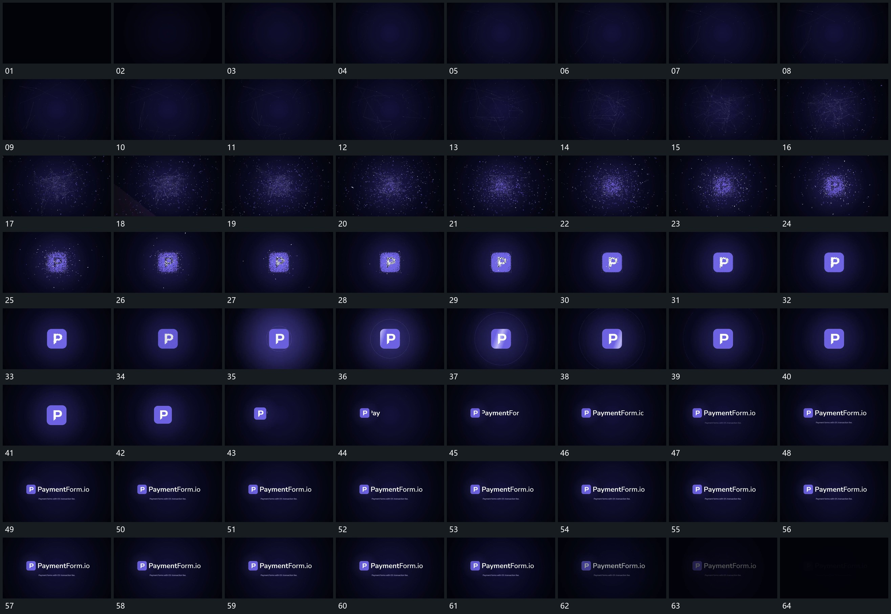

# 113 · 运动过程总览

## 运动总览

全片由[外围节点靠近中央连接逐步变密](mechanisms/m01.md)让外围节点与细线逐步靠近中央，形成更密的局部网络。随后[分散点收向目标轮廓先成边界再填齐内部](mechanisms/m02.md)把分散点继续收向目标轮廓，边界先完整，内部再逐步收齐。

主片完成后[圈线从主片附近外扩窄斜带扫过片面](mechanisms/m03.md)从其附近向外扩张圈线，窄斜带沿片面扫过；圈线退去，[主片缩小侧移旁行逐字补齐后保持](mechanisms/m04.md)把主片缩小侧移，旁行逐字补齐，最后稳定保持并退弱。

## 完整64宫格

按从左至右、从上至下阅读，覆盖全片首尾。具体运动分镜见各子机制。

## 原片与观察范围

[观看参考视频](video.mp4) · [原始来源](https://skillry.dev/ai-videos/opus-5-5/mounnna-497266)

依据真实源帧总览及必要局部序列整理，仅描述可见运动、相对布局与接续。抽帧观察不等于原速连续观看或声音核验；不推定精确曲线、隐藏结构、作者源码或原始生成指令。迁移到新片仍需实现和预览。
