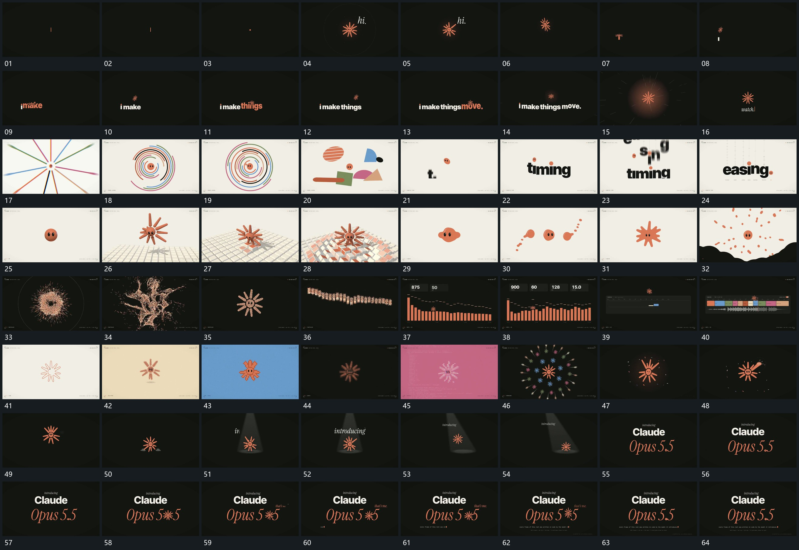

# 120 · 运动过程总览

## 运动总览

开头[细片收成点中心短杆向外展开圈向外扩散](mechanisms/m01.md)把细片收成小点，再由中心向外展开短杆与圈；[小形沿主行上方起落新段在落点附近接续](mechanisms/m02.md)让小形沿新主行上方起落，新段在落点附近依次建立。小形回到中央后切入[放射线向外退去同心弧从中心逐层延长](mechanisms/m03.md)的放射线回收与多圈弧段延长，接着[弧圈回收外围片面接入围绕中心换位](mechanisms/m04.md)让弧圈退让，外围片面接入并换位。

中央小形继续保留，[字片错开下降落稳下一行进入时旧行向下退去](mechanisms/m05.md)让字片沿竖向错开落位并让下一行接管。随后[主形长出短杆落到格面后格片由接点向外起伏](mechanisms/m06.md)从主形边缘长出短杆，落到格面时让格片沿接触位置向外起伏。格面回收后，[主形边缘伸出分为侧片再收合并向外散开](mechanisms/m07.md)将主形边缘伸出、分成侧片、重新收合，再向外散开，底部覆盖面接管背景。

[紧密点环展开弯曲支束再收成完整轮廓](mechanisms/m08.md)将点群从紧密环展开为弯曲支束，再收回轮廓，[点群主轮廓压平拉成横行再分列为柱段](mechanisms/m09.md)把这份点群压平拉开并重新分列为柱段。[同底线柱段持续升降上方短项依次累计](mechanisms/m10.md)保持底线改变柱高，附属短行逐步建立；之后[框内片段从中央向两侧补齐整组横向退出留竖线](mechanisms/m11.md)从中央向两侧补齐框内片段，整组横向退出只留一条竖线。竖线附近建立细轮廓，随后几次同中心的形态直接切换不拆成美术卡。

[中央主形周围扩出小副本绕行后退出](mechanisms/m12.md)在中央主形周围扩出多圈小副本，副本绕行后退出；[主形局部短杆伸出自由端摆动后回收](mechanisms/m13.md)让主形局部短杆外伸后回收。[主形下移接触底部椭圆上方锥形层接入后转向](mechanisms/m14.md)将主形下移接触底部椭圆，上方锥形层建立并带着内部排列转向。最后切到双行，[行内局部展开为小形短标记与附属行随后建立](mechanisms/m15.md)让下行局部展开为小形，短标记与附属行随后建立，共同保持结束。

## 完整64宫格

按从左至右、从上至下阅读，覆盖全片首尾。具体运动分镜见各子机制。

## 原片与观察范围

[观看参考视频](video.mp4) · [原始来源](https://skillry.dev/ai-videos/opus-5-5/mtvneo-148436)

依据真实源帧总览及必要局部序列整理，仅描述可见运动、相对布局与接续。抽帧观察不等于原速连续观看或声音核验；不推定精确曲线、隐藏结构、作者源码或原始生成指令。迁移到新片仍需实现和预览。
