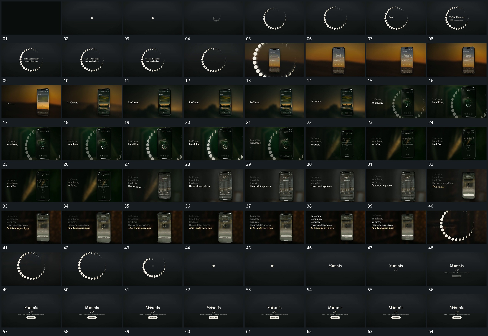

# 035 · 运动过程总览

## 运动总览

开场 [中央点扩成分段圆环，圈内文字逐行补入](mechanisms/m01.md) 从中央点扩成一圈分段小形，圈内文字逐行增加。[圆环放大越界，竖框从中心接管并换底](mechanisms/m02.md) 让环形组放大越过画面边缘，同时新竖框接入并换底。中段 [固定竖框内轮换，旁侧字组逐行累积](mechanisms/m03.md) 保留竖框位置，内部内容依次接替，旁侧文字逐行累积；环形后层也曾在竖框旁重新建立。

末段竖框退虚并让环形接手，[大圆环缩回中央点，点接入短字组后补齐附属项](mechanisms/m04.md) 将大圈收回中央点，再从该点接上短字组，附属行和小条最后补入，整体保持。

## 完整64宫格

按从左至右、从上至下阅读，覆盖全片首尾。具体运动分镜见各子机制。

## 原片与观察范围

[观看参考视频](video.mp4) · [原始来源](https://skillry.dev/ai-videos/opus-5-5/mustaphafenzar-973906)

依据真实源帧总览及必要局部序列整理，仅描述可见运动、相对布局与接续。抽帧观察不等于原速连续观看或声音核验；不推定精确曲线、隐藏结构、作者源码或原始生成指令。迁移到新片仍需实现和预览。
