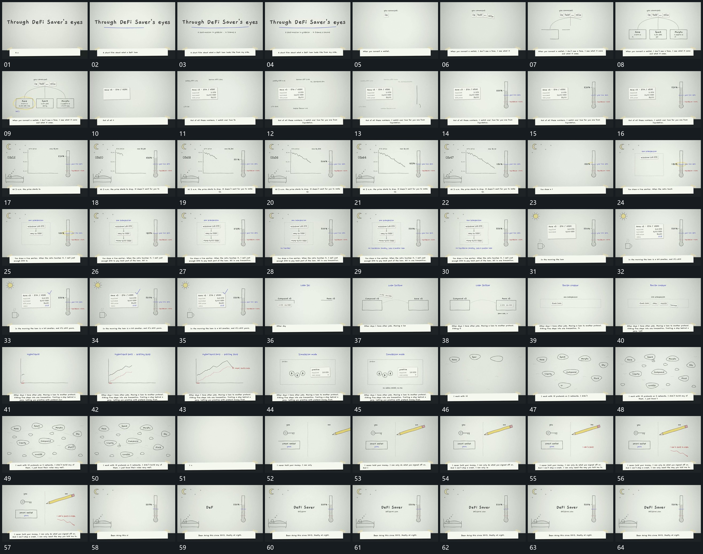

# 054 · 运动过程总览

## 运动总览

开头主字逐字建立，下线延长，底部固定长条持续输入。[上方字槽逐项建立，分支线延伸后下框补齐](mechanisms/m01.md) 从上方字槽延伸分支线，再补下方空框及内容，局部圈形最后标出一框。[片内数值逐行输入，旁轴从轮廓到上填状态](mechanisms/m02.md) 在片内逐行输入数值，旁侧竖轴从轮廓到填充；随后 [固定坐标内曲线逐段延长，旁轴高度与数值随之变化](mechanisms/m03.md) 在固定坐标中延长曲线，旁轴高度与数值同步下降。

中段 [竖向短片逐项补入，以箭头连接，旁轴随后上移](mechanisms/m04.md) 从上到下追加短片，以箭头连接，旁轴随后上移到新位置。[小片沿弧向从一框移到另一框，原框保持](mechanisms/m05.md) 用弧向运动把小片从一个框交给另一框。[固定坐标内曲线逐段延长，旁轴高度与数值随之变化](mechanisms/m03.md) 再次描出长曲线，后方虚线跟随，末端短标记接上。[外围椭圆框依次建立，虚线补齐后小形沿连接经过](mechanisms/m06.md) 让外围椭圆框从少到多建立，框间虚线补齐，小形沿连接经过。末段并置两区补入局部形与短线，旧组退出后回到稳定竖轴与中央字组，底部长条完成输入收尾。

## 完整64宫格

按从左至右、从上至下阅读，覆盖全片首尾。具体运动分镜见各子机制。

## 原片与观察范围

[观看参考视频](video.mp4) · [原始来源](https://skillry.dev/ai-videos/opus-5-5/nikolajankovic-616097)

依据真实源帧总览及必要局部序列整理，仅描述可见运动、相对布局与接续。抽帧观察不等于原速连续观看或声音核验；不推定精确曲线、隐藏结构、作者源码或原始生成指令。迁移到新片仍需实现和预览。
