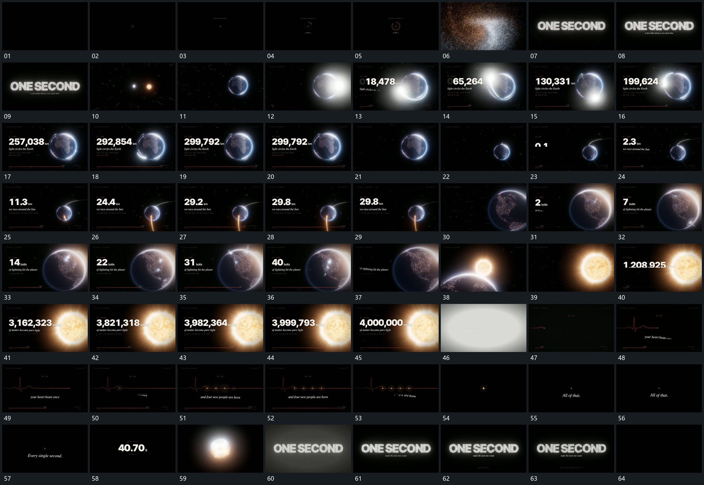

# 064 · 运动过程总览

## 运动总览

开头 [中央点建立局部弧形，点群扩开再聚成字组](mechanisms/m01.md) 从中央点建立局部弧形，弧形转动后点群扩开，重新聚成字组。[亮点沿圆形表面绕行并留轨迹，旁侧数值增长](mechanisms/m02.md) 保留侧方圆形主形，让亮点沿其表面绕行并留下轨迹，旁侧数值增长，下长条延长。

中段 [主形缩小侧移，旁侧弧向轨迹延长，数值接续](mechanisms/m03.md) 将主形缩小侧移，沿其旁侧延伸弧向长轨迹，已有轨迹保留；旁值继续变化。[主形表面短闪分批出现，局部分支线随后追加](mechanisms/m04.md) 在主形表面逐项出现短闪与小分支，外部数值随次数累积。下一主形接管后数值继续增长，最后 [亮区放大覆盖全幅，短线接管并延长为波形](mechanisms/m05.md) 放大亮区覆盖全画面，再由短线接管，波形向右延长。

后段 [波形局部小圈与点逐项建立，整组退去只留中央点](mechanisms/m06.md) 在波形局部逐项建立小圈和点，短字接续，整组退去后只留中央点。结尾重用 [中央点建立局部弧形，点群扩开再聚成字组](mechanisms/m01.md) 的点群到字组聚合，再补附属行保持。

## 完整64宫格

按从左至右、从上至下阅读，覆盖全片首尾。具体运动分镜见各子机制。

## 原片与观察范围

[观看参考视频](video.mp4) · [原始来源](https://skillry.dev/ai-videos/opus-5-5/nolkeeg-635633)

依据真实源帧总览及必要局部序列整理，仅描述可见运动、相对布局与接续。抽帧观察不等于原速连续观看或声音核验；不推定精确曲线、隐藏结构、作者源码或原始生成指令。迁移到新片仍需实现和预览。
