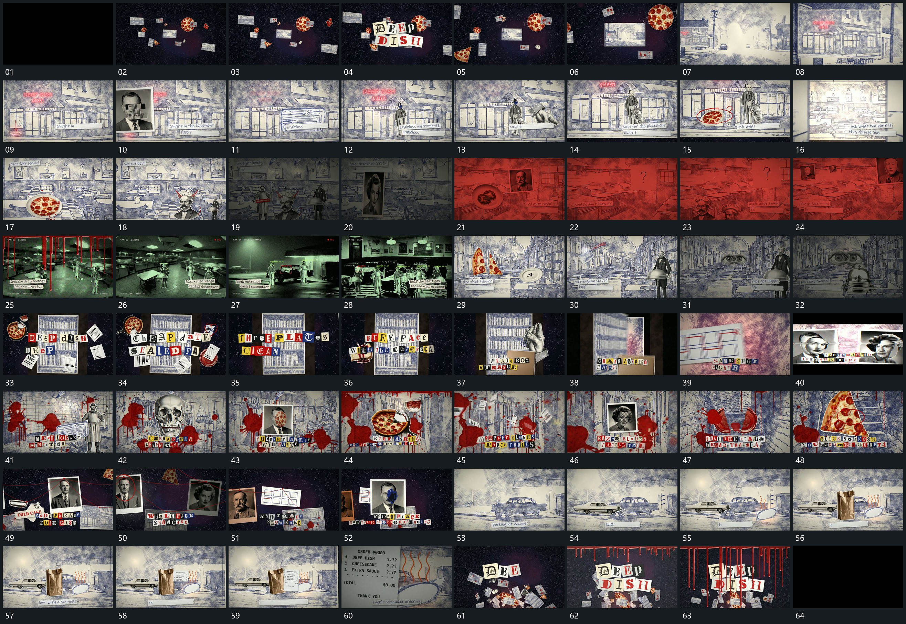

# 013 · 运动过程总览

## 运动总览

开头 [散片建立远近空间，字片组出现后推入一张平面](mechanisms/m01.md) 将散片接入一个有远近的空间，中央字片逐项组合，再从选定平面推入满幅。[固定后层中前图逐次接替，底部短条逐字补齐](mechanisms/m02.md) 在稳定后层中轮换前景图块，底部文字条逐字接续；局部描线与圈形短标记穿插出现。

中段画面按不同底层接替，[罩形前片提起斜转，内部主形由下显露](mechanisms/m07.md) 把罩形片提起并斜转移开，内部主形显露。随后 [多张字片按顺序落成多行，周边散片继续经过](mechanisms/m03.md) 将字片按阅读顺序落成多行，周边散片保持活动。[附属件在竖片前接入，竖片绕侧边打开显出后层](mechanisms/m04.md) 在竖片前补入附属件，再让竖片绕侧边打开，后层空间显露。后段重用 [固定后层中前图逐次接替，底部短条逐字补齐](mechanisms/m02.md) 轮换前图，[散片之间细线延伸，连接到多个已有局部](mechanisms/m05.md) 以细线连接散开的片，形成可追踪关联。

末段 [前层片错开接入，镜头侧移后推近局部，再返回集合](mechanisms/m06.md) 在保持后层的同时让前层片错开进入，从侧移到局部推近；再退回集合空间，字片组建立，细长条自上向下延长，最终退出。

## 完整64宫格

按从左至右、从上至下阅读，覆盖全片首尾。具体运动分镜见各子机制。

## 原片与观察范围

[观看参考视频](video.mp4) · [原始来源](https://skillry.dev/ai-videos/opus-5-5/paranoidamerica-686717)

依据真实源帧总览及必要局部序列整理，仅描述可见运动、相对布局与接续。抽帧观察不等于原速连续观看或声音核验；不推定精确曲线、隐藏结构、作者源码或原始生成指令。迁移到新片仍需实现和预览。
