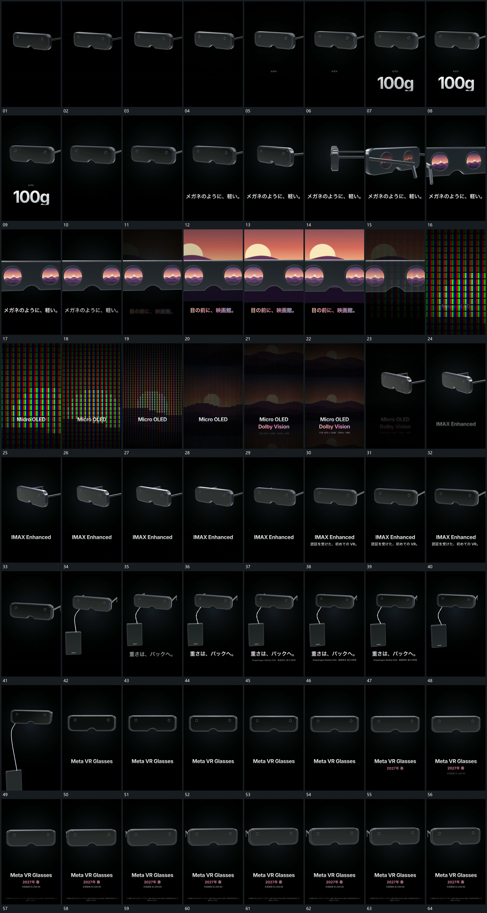

# 091 · 运动过程总览

## 运动总览

全片以[横向厚片缓慢转角字行依次建立](mechanisms/m01.md)让横向厚片在同一范围缓慢转角，字行分项接入。随后[厚片转向背面并推近双圆窗口](mechanisms/m02.md)进一步转向背面并靠近，原厚片内的双圆窗口保持同一内容来源。[后方片面从双窗之间扩大形成尺度接续](mechanisms/m03.md)在其后方扩大片面，让窗口与后片产生尺度接续。

之后[密集小格近景退镜逐步露出整体图层](mechanisms/m04.md)由密集小格近景逐步退到整体图层，再回到原厚片的全貌。后段复用[横向厚片缓慢转角字行依次建立](mechanisms/m01.md)，[曲线延长接上悬挂片共同保持后向下退去](mechanisms/m05.md)在厚片下方建立曲线与悬挂片，并沿下方退出，主片留在中央，结尾字行依次补齐。

## 完整64宫格

按从左至右、从上至下阅读，覆盖全片首尾。具体运动分镜见各子机制。

## 原片与观察范围

[观看参考视频](video.mp4) · [原始来源](https://skillry.dev/ai-videos/opus-5-5/petert-540960)

依据真实源帧总览及必要局部序列整理，仅描述可见运动、相对布局与接续。抽帧观察不等于原速连续观看或声音核验；不推定精确曲线、隐藏结构、作者源码或原始生成指令。迁移到新片仍需实现和预览。
